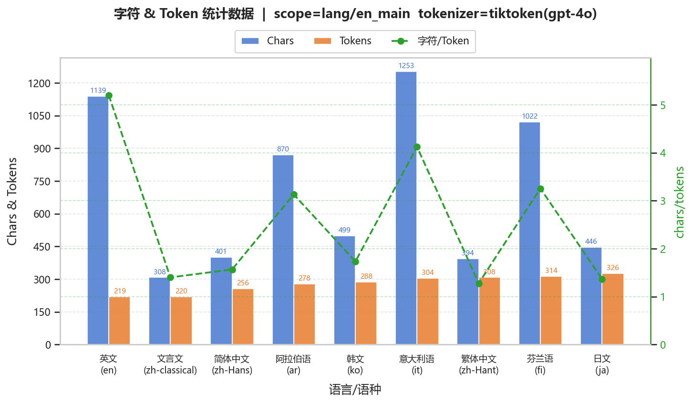
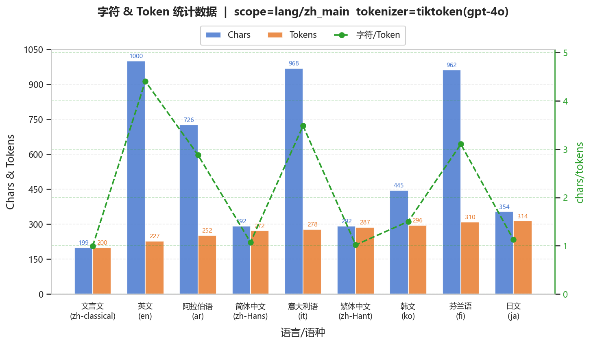
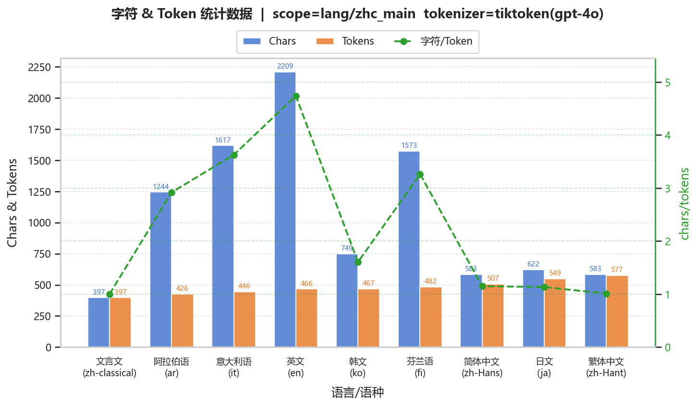
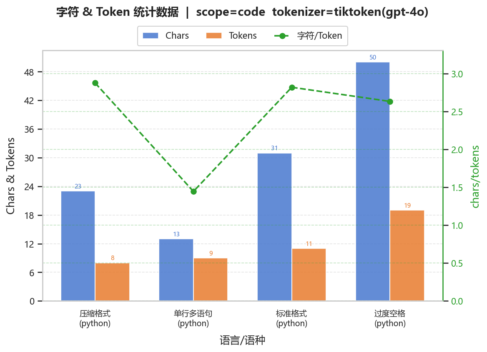
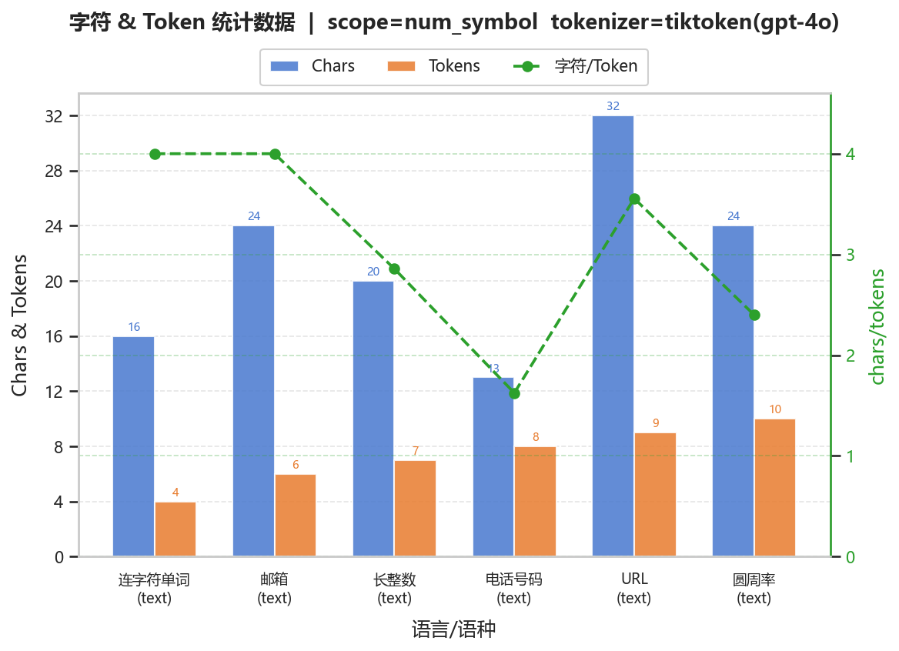
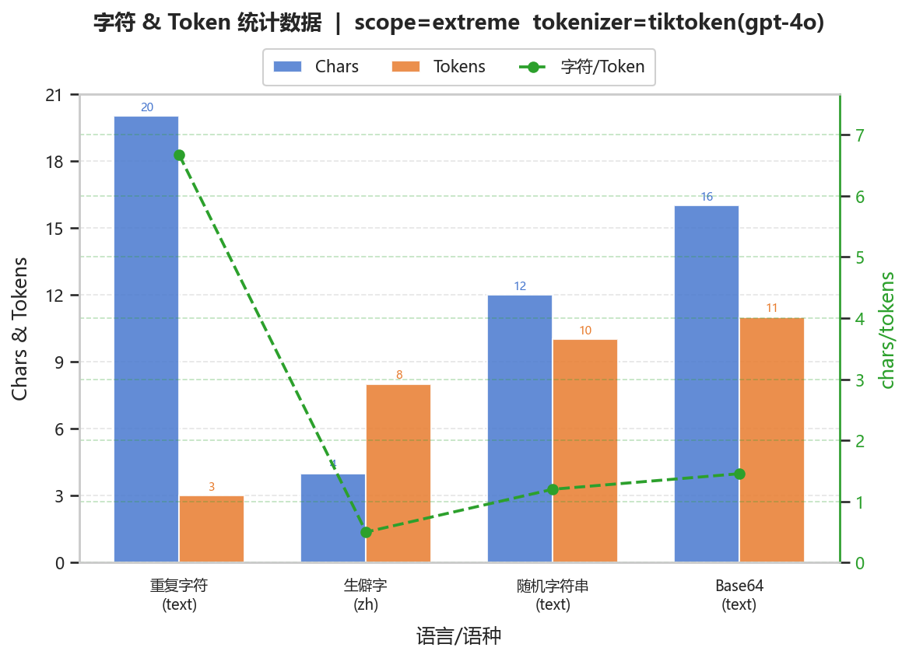
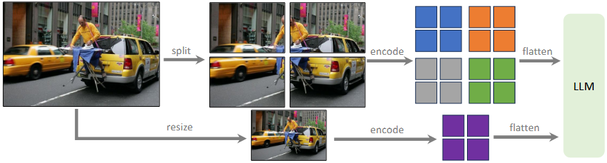
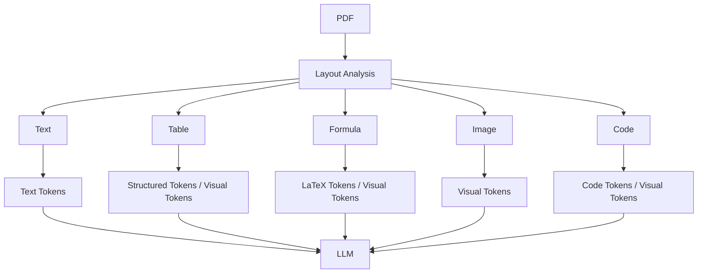

<h2 align="center">理解 LLM 中的分词</h2>

<p align="center">SleepCloud</p>


[TOC]

<div STYLE="page-break-after: always;"></div>

### 0  说明

本文是模式识别的一次小作业（写的比较水，但总归是有点xin xi l，凑合着看吧）

**任务**：尝试 https://tiktokenizer.vercel.app/、https://aistudio.google.com/ 等网站，观察和分析目前大语言模型中的tokenizer、tokens计算方式

**提示**：分析多语言差异（语言、语种）、代码与格式、数字与符号、极端情况与Emoji。例如输入一段相同含义的英文和中文，观察两者的 Token 数量差异；输入一段包含大量空格、缩进的 Python 代码，对比压缩空格前后的 Token 数量；输入长串数字（如手机号、圆周率）、带有连字符的单词或邮箱地址，观察它们是如何被切分的；测试生僻字、网络流行语或者一长串 Emoji 表情，看看 Token 是如何分配的。文本格式之外的文件呢？例如图片和pdf文件（Qwen-VL系列、InternVL系列、MiMo-VL、DeepSeek-VL等）？


### 1  多语言

#### 1.1  例子

<span title="tokens: 1805" style="background:#fecaca;padding:1px 2px;border-radius:2px">【</span><span title="tokens: 2292" style="background:#bfdbfe;padding:1px 2px;border-radius:2px">日</span><span title="tokens: 3181" style="background:#bbf7d0;padding:1px 2px;border-radius:2px">月</span><span title="tokens: 7660" style="background:#fef08a;padding:1px 2px;border-radius:2px">前</span><span title="tokens: 8669" style="background:#e9d5ff;padding:1px 2px;border-radius:2px">事</span><span title="tokens: 25004" style="background:#fed7aa;padding:1px 2px;border-radius:2px">】<br><br></span><span title="tokens: 1805" style="background:#a5f3fc;padding:1px 2px;border-radius:2px">【</span><span title="tokens: 35736, 121" style="background:#d9f99d;padding:1px 2px;border-radius:2px">鸽</span><span title="tokens: 7407" style="background:#fbcfe8;padding:1px 2px;border-radius:2px">子</span><span title="tokens: 3798, 242" style="background:#c7d2fe;padding:1px 2px;border-radius:2px">衔</span><span title="tokens: 154236" style="background:#fde68a;padding:1px 2px;border-radius:2px">枝</span><span title="tokens: 10708" style="background:#99f6e4;padding:1px 2px;border-radius:2px">之</span><span title="tokens: 2810" style="background:#fca5a5;padding:1px 2px;border-radius:2px">年</span><span title="tokens: 37157" style="background:#ddd6fe;padding:1px 2px;border-radius:2px">】<br></span><span title="tokens: 867" style="background:#bae6fd;padding:1px 2px;border-radius:2px">天</span><span title="tokens: 4286" style="background:#a7f3d0;padding:1px 2px;border-radius:2px">上</span><span title="tokens: 30360" style="background:#fcd34d;padding:1px 2px;border-radius:2px">永</span><span title="tokens: 78419" style="background:#f9a8d4;padding:1px 2px;border-radius:2px">恒</span><span title="tokens: 1616" style="background:#86efac;padding:1px 2px;border-radius:2px">的</span><span title="tokens: 15881" style="background:#93c5fd;padding:1px 2px;border-radius:2px">王</span><span title="tokens: 34158" style="background:#fecaca;padding:1px 2px;border-radius:2px">座</span><span title="tokens: 6946" style="background:#bfdbfe;padding:1px 2px;border-radius:2px">到</span><span title="tokens: 6727" style="background:#bbf7d0;padding:1px 2px;border-radius:2px">来</span><span title="tokens: 979" style="background:#fef08a;padding:1px 2px;border-radius:2px">，</span><span title="tokens: 28428" style="background:#e9d5ff;padding:1px 2px;border-radius:2px">世界</span><span title="tokens: 6209" style="background:#fed7aa;padding:1px 2px;border-radius:2px">为</span><span title="tokens: 10708" style="background:#a5f3fc;padding:1px 2px;border-radius:2px">之</span><span title="tokens: 6983, 243" style="background:#d9f99d;padding:1px 2px;border-radius:2px">焕</span><span title="tokens: 16125" style="background:#fbcfe8;padding:1px 2px;border-radius:2px">然</span><span title="tokens: 2432" style="background:#c7d2fe;padding:1px 2px;border-radius:2px">一</span><span title="tokens: 3711" style="background:#fde68a;padding:1px 2px;border-radius:2px">新</span><span title="tokens: 3414" style="background:#99f6e4;padding:1px 2px;border-radius:2px">。<br></span><span title="tokens: 119014" style="background:#fca5a5;padding:1px 2px;border-radius:2px">然后</span><span title="tokens: 7910" style="background:#ddd6fe;padding:1px 2px;border-radius:2px">真</span><span title="tokens: 15881" style="background:#bae6fd;padding:1px 2px;border-radius:2px">王</span><span title="tokens: 979" style="background:#a7f3d0;padding:1px 2px;border-radius:2px">，</span><span title="tokens: 14085" style="background:#fcd34d;padding:1px 2px;border-radius:2px">原</span><span title="tokens: 26719" style="background:#f9a8d4;padding:1px 2px;border-radius:2px">初</span><span title="tokens: 1616" style="background:#86efac;padding:1px 2px;border-radius:2px">的</span><span title="tokens: 18818" style="background:#93c5fd;padding:1px 2px;border-radius:2px">那</span><span title="tokens: 2432" style="background:#fecaca;padding:1px 2px;border-radius:2px">一</span><span title="tokens: 9838" style="background:#bfdbfe;padding:1px 2px;border-radius:2px">位</span><span title="tokens: 40914" style="background:#bbf7d0;padding:1px 2px;border-radius:2px">开始</span><span title="tokens: 5884" style="background:#fef08a;padding:1px 2px;border-radius:2px">和</span><span title="tokens: 67803" style="background:#e9d5ff;padding:1px 2px;border-radius:2px">旧</span><span title="tokens: 28428" style="background:#fed7aa;padding:1px 2px;border-radius:2px">世界</span><span title="tokens: 1616" style="background:#a5f3fc;padding:1px 2px;border-radius:2px">的</span><span title="tokens: 126207" style="background:#d9f99d;padding:1px 2px;border-radius:2px">主人</span><span title="tokens: 13932" style="background:#fbcfe8;padding:1px 2px;border-radius:2px">们</span><span title="tokens: 979" style="background:#c7d2fe;padding:1px 2px;border-radius:2px">，</span><span title="tokens: 28980" style="background:#fde68a;padding:1px 2px;border-radius:2px">七</span><span title="tokens: 9838" style="background:#99f6e4;padding:1px 2px;border-radius:2px">位</span><span title="tokens: 54436" style="background:#fca5a5;padding:1px 2px;border-radius:2px">恐</span><span title="tokens: 133986" style="background:#ddd6fe;padding:1px 2px;border-radius:2px">怖</span><span title="tokens: 1640" style="background:#bae6fd;padding:1px 2px;border-radius:2px">大</span><span title="tokens: 15881" style="background:#a7f3d0;padding:1px 2px;border-radius:2px">王</span><span title="tokens: 3044" style="background:#fcd34d;padding:1px 2px;border-radius:2px">开</span><span title="tokens: 19366" style="background:#f9a8d4;padding:1px 2px;border-radius:2px">战</span><span title="tokens: 3414" style="background:#86efac;padding:1px 2px;border-radius:2px">。<br></span><span title="tokens: 18818" style="background:#93c5fd;padding:1px 2px;border-radius:2px">那</span><span title="tokens: 54436" style="background:#fecaca;padding:1px 2px;border-radius:2px">恐</span><span title="tokens: 133986" style="background:#bfdbfe;padding:1px 2px;border-radius:2px">怖</span><span title="tokens: 134637" style="background:#bbf7d0;padding:1px 2px;border-radius:2px">的大</span><span title="tokens: 15881" style="background:#fef08a;padding:1px 2px;border-radius:2px">王</span><span title="tokens: 13932" style="background:#e9d5ff;padding:1px 2px;border-radius:2px">们</span><span title="tokens: 3221" style="background:#fed7aa;padding:1px 2px;border-radius:2px">是</span><span title="tokens: 16271" style="background:#a5f3fc;padding:1px 2px;border-radius:2px">龙</span><span title="tokens: 3414" style="background:#d9f99d;padding:1px 2px;border-radius:2px">。<br></span><span title="tokens: 14085" style="background:#fbcfe8;padding:1px 2px;border-radius:2px">原</span><span title="tokens: 26719" style="background:#c7d2fe;padding:1px 2px;border-radius:2px">初</span><span title="tokens: 1616" style="background:#fde68a;padding:1px 2px;border-radius:2px">的</span><span title="tokens: 18818" style="background:#99f6e4;padding:1px 2px;border-radius:2px">那</span><span title="tokens: 2432" style="background:#fca5a5;padding:1px 2px;border-radius:2px">一</span><span title="tokens: 9838" style="background:#ddd6fe;padding:1px 2px;border-radius:2px">位</span><span title="tokens: 23985" style="background:#bae6fd;padding:1px 2px;border-radius:2px">造</span><span title="tokens: 155198" style="background:#a7f3d0;padding:1px 2px;border-radius:2px">出了</span><span title="tokens: 39766" style="background:#fcd34d;padding:1px 2px;border-radius:2px">自己</span><span title="tokens: 2233" style="background:#f9a8d4;padding:1px 2px;border-radius:2px">发</span><span title="tokens: 17374" style="background:#86efac;padding:1px 2px;border-radius:2px">着</span><span title="tokens: 20244" style="background:#93c5fd;padding:1px 2px;border-radius:2px">光</span><span title="tokens: 1616" style="background:#fecaca;padding:1px 2px;border-radius:2px">的</span><span title="tokens: 5235" style="background:#bfdbfe;padding:1px 2px;border-radius:2px">影</span><span title="tokens: 7407" style="background:#bbf7d0;padding:1px 2px;border-radius:2px">子</span><span title="tokens: 3414" style="background:#fef08a;padding:1px 2px;border-radius:2px">。<br></span><span title="tokens: 15479" style="background:#e9d5ff;padding:1px 2px;border-radius:2px">而</span><span title="tokens: 5235" style="background:#fed7aa;padding:1px 2px;border-radius:2px">影</span><span title="tokens: 185317" style="background:#a5f3fc;padding:1px 2px;border-radius:2px">子的</span><span title="tokens: 80012" style="background:#d9f99d;padding:1px 2px;border-radius:2px">数量</span><span title="tokens: 3221" style="background:#fbcfe8;padding:1px 2px;border-radius:2px">是</span><span title="tokens: 11455" style="background:#c7d2fe;padding:1px 2px;border-radius:2px">四</span><span title="tokens: 1497" style="background:#fde68a;padding:1px 2px;border-radius:2px">。<br><br></span><span title="tokens: 1805" style="background:#99f6e4;padding:1px 2px;border-radius:2px">【</span><span title="tokens: 5625" style="background:#fca5a5;padding:1px 2px;border-radius:2px">法</span><span title="tokens: 10845, 227" style="background:#ddd6fe;padding:1px 2px;border-radius:2px">涅</span><span title="tokens: 18384" style="background:#bae6fd;padding:1px 2px;border-radius:2px">斯</span><span title="tokens: 979" style="background:#a7f3d0;padding:1px 2px;border-radius:2px">，</span><span title="tokens: 89359" style="background:#fcd34d;padding:1px 2px;border-radius:2px">或者</span><span title="tokens: 14085" style="background:#f9a8d4;padding:1px 2px;border-radius:2px">原</span><span title="tokens: 26719" style="background:#86efac;padding:1px 2px;border-radius:2px">初</span><span title="tokens: 1616" style="background:#93c5fd;padding:1px 2px;border-radius:2px">的</span><span title="tokens: 18818" style="background:#fecaca;padding:1px 2px;border-radius:2px">那</span><span title="tokens: 2432" style="background:#bfdbfe;padding:1px 2px;border-radius:2px">一</span><span title="tokens: 9838" style="background:#bbf7d0;padding:1px 2px;border-radius:2px">位</span><span title="tokens: 37157" style="background:#fef08a;padding:1px 2px;border-radius:2px">】<br></span><span title="tokens: 14085" style="background:#e9d5ff;padding:1px 2px;border-radius:2px">原</span><span title="tokens: 26719" style="background:#fed7aa;padding:1px 2px;border-radius:2px">初</span><span title="tokens: 1616" style="background:#a5f3fc;padding:1px 2px;border-radius:2px">的</span><span title="tokens: 18818" style="background:#d9f99d;padding:1px 2px;border-radius:2px">那</span><span title="tokens: 2432" style="background:#fbcfe8;padding:1px 2px;border-radius:2px">一</span><span title="tokens: 9838" style="background:#c7d2fe;padding:1px 2px;border-radius:2px">位</span><span title="tokens: 979" style="background:#fde68a;padding:1px 2px;border-radius:2px">，</span><span title="tokens: 23730" style="background:#99f6e4;padding:1px 2px;border-radius:2px">或</span><span title="tokens: 37225" style="background:#fca5a5;padding:1px 2px;border-radius:2px">许</span><span title="tokens: 3221" style="background:#ddd6fe;padding:1px 2px;border-radius:2px">是</span><span title="tokens: 5625" style="background:#bae6fd;padding:1px 2px;border-radius:2px">法</span><span title="tokens: 10845, 227" style="background:#a7f3d0;padding:1px 2px;border-radius:2px">涅</span><span title="tokens: 18384" style="background:#fcd34d;padding:1px 2px;border-radius:2px">斯</span><span title="tokens: 3414" style="background:#f9a8d4;padding:1px 2px;border-radius:2px">。<br></span><span title="tokens: 46569" style="background:#86efac;padding:1px 2px;border-radius:2px">它</span><span title="tokens: 5883" style="background:#93c5fd;padding:1px 2px;border-radius:2px">生</span><span title="tokens: 17374" style="background:#fecaca;padding:1px 2px;border-radius:2px">着</span><span title="tokens: 136458" style="background:#bfdbfe;padding:1px 2px;border-radius:2px">羽</span><span title="tokens: 80704" style="background:#bbf7d0;padding:1px 2px;border-radius:2px">翼</span><span title="tokens: 979" style="background:#fef08a;padding:1px 2px;border-radius:2px">，</span><span title="tokens: 18578" style="background:#e9d5ff;padding:1px 2px;border-radius:2px">头</span><span title="tokens: 109282" style="background:#fed7aa;padding:1px 2px;border-radius:2px">戴</span><span title="tokens: 15881" style="background:#a5f3fc;padding:1px 2px;border-radius:2px">王</span><span title="tokens: 26423" style="background:#d9f99d;padding:1px 2px;border-radius:2px">冠</span><span title="tokens: 62163" style="background:#fbcfe8;padding:1px 2px;border-radius:2px">，从</span><span title="tokens: 41964" style="background:#c7d2fe;padding:1px 2px;border-radius:2px">蛋</span><span title="tokens: 1404" style="background:#fde68a;padding:1px 2px;border-radius:2px">中</span><span title="tokens: 159618" style="background:#99f6e4;padding:1px 2px;border-radius:2px">出生</span><span title="tokens: 979" style="background:#fca5a5;padding:1px 2px;border-radius:2px">，</span><span title="tokens: 38130" style="background:#ddd6fe;padding:1px 2px;border-radius:2px">难</span><span title="tokens: 5924" style="background:#bae6fd;padding:1px 2px;border-radius:2px">以</span><span title="tokens: 2957" style="background:#a7f3d0;padding:1px 2px;border-radius:2px">分</span><span title="tokens: 194511" style="background:#fcd34d;padding:1px 2px;border-radius:2px">辨</span><span title="tokens: 5546, 234" style="background:#f9a8d4;padding:1px 2px;border-radius:2px">雌</span><span title="tokens: 52446" style="background:#86efac;padding:1px 2px;border-radius:2px">雄</span><span title="tokens: 3414" style="background:#93c5fd;padding:1px 2px;border-radius:2px">。<br></span><span title="tokens: 72236" style="background:#fecaca;padding:1px 2px;border-radius:2px">但是</span><span title="tokens: 28428" style="background:#bfdbfe;padding:1px 2px;border-radius:2px">世界</span><span title="tokens: 43442" style="background:#bbf7d0;padding:1px 2px;border-radius:2px">如果</span><span title="tokens: 7724" style="background:#fef08a;padding:1px 2px;border-radius:2px">要</span><span title="tokens: 14731" style="background:#e9d5ff;padding:1px 2px;border-radius:2px">被</span><span title="tokens: 158127" style="background:#fed7aa;padding:1px 2px;border-radius:2px">创造</span><span title="tokens: 979" style="background:#a5f3fc;padding:1px 2px;border-radius:2px">，</span><span title="tokens: 41964" style="background:#d9f99d;padding:1px 2px;border-radius:2px">蛋</span><span title="tokens: 10392, 111" style="background:#fbcfe8;padding:1px 2px;border-radius:2px">壳</span><span title="tokens: 82654" style="background:#c7d2fe;padding:1px 2px;border-radius:2px">必须</span><span title="tokens: 14731" style="background:#fde68a;padding:1px 2px;border-radius:2px">被</span><span title="tokens: 15552" style="background:#99f6e4;padding:1px 2px;border-radius:2px">打</span><span title="tokens: 18311" style="background:#fca5a5;padding:1px 2px;border-radius:2px">破</span><span title="tokens: 3414" style="background:#ddd6fe;padding:1px 2px;border-radius:2px">。<br></span><span title="tokens: 5625" style="background:#bae6fd;padding:1px 2px;border-radius:2px">法</span><span title="tokens: 10845, 227" style="background:#a7f3d0;padding:1px 2px;border-radius:2px">涅</span><span title="tokens: 18384" style="background:#fcd34d;padding:1px 2px;border-radius:2px">斯</span><span title="tokens: 8290" style="background:#f9a8d4;padding:1px 2px;border-radius:2px">——</span><span title="tokens: 14085" style="background:#86efac;padding:1px 2px;border-radius:2px">原</span><span title="tokens: 26719" style="background:#93c5fd;padding:1px 2px;border-radius:2px">初</span><span title="tokens: 1616" style="background:#fecaca;padding:1px 2px;border-radius:2px">的</span><span title="tokens: 18818" style="background:#bfdbfe;padding:1px 2px;border-radius:2px">那</span><span title="tokens: 2432" style="background:#bbf7d0;padding:1px 2px;border-radius:2px">一</span><span title="tokens: 9838" style="background:#fef08a;padding:1px 2px;border-radius:2px">位</span><span title="tokens: 8290" style="background:#e9d5ff;padding:1px 2px;border-radius:2px">——</span><span title="tokens: 56896" style="background:#fed7aa;padding:1px 2px;border-radius:2px">却</span><span title="tokens: 5615" style="background:#a5f3fc;padding:1px 2px;border-radius:2px">用</span><span title="tokens: 41964" style="background:#d9f99d;padding:1px 2px;border-radius:2px">蛋</span><span title="tokens: 10392, 111" style="background:#fbcfe8;padding:1px 2px;border-radius:2px">壳</span><span title="tokens: 87845" style="background:#c7d2fe;padding:1px 2px;border-radius:2px">隔</span><span title="tokens: 48321" style="background:#fde68a;padding:1px 2px;border-radius:2px">绝</span><span title="tokens: 4531" style="background:#99f6e4;padding:1px 2px;border-radius:2px">了</span><span title="tokens: 6055" style="background:#fca5a5;padding:1px 2px;border-radius:2px">「</span><span title="tokens: 58212" style="background:#ddd6fe;padding:1px 2px;border-radius:2px">宇</span><span title="tokens: 1376, 247" style="background:#bae6fd;padding:1px 2px;border-radius:2px">宙</span><span title="tokens: 5252" style="background:#a7f3d0;padding:1px 2px;border-radius:2px">」</span><span title="tokens: 5884" style="background:#fcd34d;padding:1px 2px;border-radius:2px">和</span><span title="tokens: 6055" style="background:#f9a8d4;padding:1px 2px;border-radius:2px">「</span><span title="tokens: 28428" style="background:#86efac;padding:1px 2px;border-radius:2px">世界</span><span title="tokens: 1616" style="background:#93c5fd;padding:1px 2px;border-radius:2px">的</span><span title="tokens: 74299" style="background:#fecaca;padding:1px 2px;border-radius:2px">缩</span><span title="tokens: 5235" style="background:#bfdbfe;padding:1px 2px;border-radius:2px">影</span><span title="tokens: 166040" style="background:#bbf7d0;padding:1px 2px;border-radius:2px">」。<br><br></span><span title="tokens: 1805" style="background:#fef08a;padding:1px 2px;border-radius:2px">【</span><span title="tokens: 3798, 242" style="background:#e9d5ff;padding:1px 2px;border-radius:2px">衔</span><span title="tokens: 154236" style="background:#fed7aa;padding:1px 2px;border-radius:2px">枝</span><span title="tokens: 8903" style="background:#a5f3fc;padding:1px 2px;border-radius:2px">后</span><span title="tokens: 11455" style="background:#d9f99d;padding:1px 2px;border-radius:2px">四</span><span title="tokens: 14334" style="background:#fbcfe8;padding:1px 2px;border-radius:2px">十</span><span title="tokens: 32982" style="background:#c7d2fe;padding:1px 2px;border-radius:2px">余</span><span title="tokens: 2810" style="background:#fde68a;padding:1px 2px;border-radius:2px">年</span><span title="tokens: 37157" style="background:#99f6e4;padding:1px 2px;border-radius:2px">】<br></span><span title="tokens: 11455" style="background:#fca5a5;padding:1px 2px;border-radius:2px">四</span><span title="tokens: 14334" style="background:#ddd6fe;padding:1px 2px;border-radius:2px">十</span><span title="tokens: 5920" style="background:#bae6fd;padding:1px 2px;border-radius:2px">个</span><span title="tokens: 80738" style="background:#a7f3d0;padding:1px 2px;border-radius:2px">冬</span><span title="tokens: 867" style="background:#fcd34d;padding:1px 2px;border-radius:2px">天</span><span title="tokens: 6252, 233" style="background:#f9a8d4;padding:1px 2px;border-radius:2px">埋</span><span title="tokens: 21930, 105" style="background:#86efac;padding:1px 2px;border-radius:2px">葬</span><span title="tokens: 4531" style="background:#93c5fd;padding:1px 2px;border-radius:2px">了</span><span title="tokens: 21280" style="background:#fecaca;padding:1px 2px;border-radius:2px">火</span><span title="tokens: 979" style="background:#bfdbfe;padding:1px 2px;border-radius:2px">，</span><span title="tokens: 11455" style="background:#bbf7d0;padding:1px 2px;border-radius:2px">四</span><span title="tokens: 14334" style="background:#fef08a;padding:1px 2px;border-radius:2px">十</span><span title="tokens: 5920" style="background:#e9d5ff;padding:1px 2px;border-radius:2px">个</span><span title="tokens: 35469" style="background:#fed7aa;padding:1px 2px;border-radius:2px">夏</span><span title="tokens: 867" style="background:#a5f3fc;padding:1px 2px;border-radius:2px">天</span><span title="tokens: 5739, 116" style="background:#d9f99d;padding:1px 2px;border-radius:2px">沸</span><span title="tokens: 104472" style="background:#fbcfe8;padding:1px 2px;border-radius:2px">腾</span><span title="tokens: 4531" style="background:#c7d2fe;padding:1px 2px;border-radius:2px">了</span><span title="tokens: 12426" style="background:#fde68a;padding:1px 2px;border-radius:2px">海</span><span title="tokens: 3414" style="background:#99f6e4;padding:1px 2px;border-radius:2px">。<br></span><span title="tokens: 28980" style="background:#fca5a5;padding:1px 2px;border-radius:2px">七</span><span title="tokens: 9838" style="background:#ddd6fe;padding:1px 2px;border-radius:2px">位</span><span title="tokens: 1640" style="background:#bae6fd;padding:1px 2px;border-radius:2px">大</span><span title="tokens: 15881" style="background:#a7f3d0;padding:1px 2px;border-radius:2px">王</span><span title="tokens: 55469" style="background:#fcd34d;padding:1px 2px;border-radius:2px">全部</span><span title="tokens: 14731" style="background:#f9a8d4;padding:1px 2px;border-radius:2px">被</span><span title="tokens: 15552" style="background:#86efac;padding:1px 2px;border-radius:2px">打</span><span title="tokens: 28901" style="background:#93c5fd;padding:1px 2px;border-radius:2px">败</span><span title="tokens: 979" style="background:#fecaca;padding:1px 2px;border-radius:2px">，</span><span title="tokens: 28980" style="background:#bfdbfe;padding:1px 2px;border-radius:2px">七</span><span title="tokens: 5920" style="background:#bbf7d0;padding:1px 2px;border-radius:2px">个</span><span title="tokens: 15881" style="background:#fef08a;padding:1px 2px;border-radius:2px">王</span><span title="tokens: 3052" style="background:#e9d5ff;padding:1px 2px;border-radius:2px">国</span><span title="tokens: 55469" style="background:#fed7aa;padding:1px 2px;border-radius:2px">全部</span><span title="tokens: 9353" style="background:#a5f3fc;padding:1px 2px;border-radius:2px">对</span><span title="tokens: 867" style="background:#d9f99d;padding:1px 2px;border-radius:2px">天</span><span title="tokens: 4286" style="background:#fbcfe8;padding:1px 2px;border-radius:2px">上</span><span title="tokens: 3512, 107" style="background:#c7d2fe;padding:1px 2px;border-radius:2px">俯</span><span title="tokens: 15425" style="background:#fde68a;padding:1px 2px;border-radius:2px">首</span><span title="tokens: 17655" style="background:#99f6e4;padding:1px 2px;border-radius:2px">称</span><span title="tokens: 71915" style="background:#fca5a5;padding:1px 2px;border-radius:2px">臣</span><span title="tokens: 3414" style="background:#ddd6fe;padding:1px 2px;border-radius:2px">。<br></span><span title="tokens: 14085" style="background:#bae6fd;padding:1px 2px;border-radius:2px">原</span><span title="tokens: 26719" style="background:#a7f3d0;padding:1px 2px;border-radius:2px">初</span><span title="tokens: 1616" style="background:#fcd34d;padding:1px 2px;border-radius:2px">的</span><span title="tokens: 18818" style="background:#f9a8d4;padding:1px 2px;border-radius:2px">那</span><span title="tokens: 2432" style="background:#86efac;padding:1px 2px;border-radius:2px">一</span><span title="tokens: 9838" style="background:#93c5fd;padding:1px 2px;border-radius:2px">位</span><span title="tokens: 1640" style="background:#fecaca;padding:1px 2px;border-radius:2px">大</span><span title="tokens: 15881" style="background:#bfdbfe;padding:1px 2px;border-radius:2px">王</span><span title="tokens: 40914" style="background:#bbf7d0;padding:1px 2px;border-radius:2px">开始</span><span title="tokens: 4531" style="background:#fef08a;padding:1px 2px;border-radius:2px">了</span><span title="tokens: 139251" style="background:#e9d5ff;padding:1px 2px;border-radius:2px">天地</span><span title="tokens: 1616" style="background:#fed7aa;padding:1px 2px;border-radius:2px">的</span><span title="tokens: 158127" style="background:#a5f3fc;padding:1px 2px;border-radius:2px">创造</span><span title="tokens: 3414" style="background:#d9f99d;padding:1px 2px;border-radius:2px">。<br></span><span title="tokens: 147655" style="background:#fbcfe8;padding:1px 2px;border-radius:2px">为了</span><span title="tokens: 6055" style="background:#c7d2fe;padding:1px 2px;border-radius:2px">「</span><span title="tokens: 24809" style="background:#fde68a;padding:1px 2px;border-radius:2px">我们</span><span title="tokens: 5252" style="background:#99f6e4;padding:1px 2px;border-radius:2px">」</span><span title="tokens: 8290" style="background:#fca5a5;padding:1px 2px;border-radius:2px">——</span><span title="tokens: 46569" style="background:#ddd6fe;padding:1px 2px;border-radius:2px">它</span><span title="tokens: 5889" style="background:#bae6fd;padding:1px 2px;border-radius:2px">最</span><span title="tokens: 6571" style="background:#a7f3d0;padding:1px 2px;border-radius:2px">可</span><span title="tokens: 2657, 250" style="background:#fcd34d;padding:1px 2px;border-radius:2px">怜</span><span title="tokens: 62634" style="background:#f9a8d4;padding:1px 2px;border-radius:2px">的人</span><span title="tokens: 30451" style="background:#86efac;padding:1px 2px;border-radius:2px">儿</span><span title="tokens: 15038" style="background:#93c5fd;padding:1px 2px;border-radius:2px">将</span><span title="tokens: 6390" style="background:#fecaca;padding:1px 2px;border-radius:2px">出</span><span title="tokens: 50399" style="background:#bfdbfe;padding:1px 2px;border-radius:2px">现在</span><span title="tokens: 8327" style="background:#bbf7d0;padding:1px 2px;border-radius:2px">这</span><span title="tokens: 4810" style="background:#fef08a;padding:1px 2px;border-radius:2px">片</span><span title="tokens: 1640" style="background:#e9d5ff;padding:1px 2px;border-radius:2px">大</span><span title="tokens: 5557" style="background:#fed7aa;padding:1px 2px;border-radius:2px">地</span><span title="tokens: 1497" style="background:#a5f3fc;padding:1px 2px;border-radius:2px">。<br><br></span><span title="tokens: 8010" style="background:#d9f99d;padding:1px 2px;border-radius:2px">……</span><span title="tokens: 59131" style="background:#fbcfe8;padding:1px 2px;border-radius:2px">……</span>

**注**：若使用 .md 或 .html 打开，**鼠标悬浮在字符上会显示对应的 token**（一个字符可能会对应多个 tokens，例如 “鸽”）。


#### 1.2  统计

> 使用示例见 `code/data/lang/<sub_type>/001.json`。

（1）英文 $\xrightarrow{翻译}$ 其他语言



> 使用《Attention is All You Need》摘要。

（2）中文 $\xrightarrow{翻译}$ 其他语言



> 使用原神《日月前事》节选。

（3）文言文 $\xrightarrow{翻译}$ 其他语言



> 使用《桃花源记》。


#### 1.3  分析

**（1）整体规律**

- 字符密度高语言（中文、日文）：token数≈字符数（char/token≈1–1.5）
- 词边界明确语言（英文、意大利语）：token数显著更少（char/token≈3–5）
- 形态复杂语言（芬兰语、阿拉伯语）：处于中间区间（≈3左右）
- 该分布在不同语料中保持一致，说明差异主要由语言结构决定 

**（2）中英对比**

- 对比
  - 英文：char/token≈4–5，一个token对应多个字符
  - 中文：char/token≈1–1.5，接近“一字一token”
- 差异来源：
  - 英文：BPE子词分词，高频词与词缀可合并
  - 中文：缺乏显式词边界，分词退化为字级或近字级

**（3）文言文**

char/token≈1.0，几乎完全一一对应

- 词汇极短，组合空间有限
- 语料覆盖弱，缺乏稳定子词单元
- 几乎不存在可压缩结构

**（4）跨预料一致性**

- 英文始终最高压缩率（≈4–5）
- 中文系语言稳定低压缩（≈1–1.5）
- 芬兰语、阿拉伯语稳定中等（≈3）
- 表明token分布主要由语言统计结构而非具体文本内容决定

**（5）token 级可视化观察**

- 中文：
  - 多数汉字对应单token
  - 少量生僻字或低频字被拆分
  - 高频词（如“世界”）可能整体合并
- 英文：单词被拆为子词（如 Primordial → Prim + ordial）
- 结论：基本单位为“统计子串”，而非语言学意义上的词或字


#### 1.4  总表

| 语言     | char/token（典型） | 分词粒度特征         | 结构特点             | 压缩效率 | 主要原因                       |
| -------- | ------------------ | -------------------- | -------------------- | -------- | ------------------------------ |
| 英文     | ≈ 4–5              | 子词级（subword）    | 明确空格分词         | 高       | 高频词与词缀可合并（BPE有效）  |
| 简体中文 | ≈ 1.0–1.5          | 字级 / 近字级        | 无显式词边界         | 低       | 分词退化为单字，合并空间有限   |
| 繁体中文 | ≈ 1.0–1.3          | 字级 / 更细粒度      | 字形更分散           | 更低     | 语料频率更分散，合并更困难     |
| 文言文   | ≈ 1.0              | 几乎完全字级         | 高度压缩语义表达     | 极低     | 短词+低频组合，几乎不可合并    |
| 日文     | ≈ 1.1–1.4          | 混合（汉字+假名）    | 部分有词边界信息     | 低       | 假名提供一定结构，但仍接近字级 |
| 韩文     | ≈ 1.5–1.8          | 音节块级（syllable） | 黏着语，形态变化明显 | 中低     | 词形变化导致子词难稳定复用     |
| 意大利语 | ≈ 3–4              | 子词级               | 屈折语               | 中高     | 词形变化存在，但词干稳定       |
| 芬兰语   | ≈ 3                | 子词级               | 强黏着语             | 中       | 长词+复杂形态，拆分较多        |
| 阿拉伯语 | ≈ 2.8–3.2          | 子词级               | 词根-词形结构        | 中       | 词形变化复杂但存在模式性       |


#### 1.5  结论

**（1）tokenization 的本质与影响**

- token ≠ 字符 ≠ 词，而是频率驱动的编码单元

- 语言结构决定压缩效率：

  - 空格分词语言 → 高压缩

  - 表意文字 → 低压缩

  - 低资源文本（如文言文）→ 几乎不可压缩

- 成本影响：相同语义下，中文token数≈英文的1.2–1.5倍

**（2）启示**

- 一般认为中文比英文简洁凝练，这在“篇幅”或者“字符数”上是正确的，然而<u>分词时中文占劣势，不如英文。</u>
- 文言文比简体中文白话文简洁凝练，然而需要注意<u>一个字符可能对应多个 tokens</u>，尽管如此，在测试环境中，<u>文言文 tokens 比白话文少</u>，然而这不意味着文言文更佳，现代场景下用文言文，可能会带来语义的偏差，并增大理解的难度，对 LLM 可能不如语料更丰富的白话文效果好。
- 一般用原生语言撰写再翻译到其他语言，原生语言的 tokens 会略有优势。

<div STYLE="page-break-after: always;"></div>

### 2  其他文本内容

#### 2.1  代码与格式

##### 2.1.1  分词示例

**（1）标准格式**

chars = 31, tokens = 11, chars/tokens = 2.82

<span title="tokens: 1314" style="background:#fecaca;padding:1px 2px;border-radius:2px">def</span><span title="tokens: 1147" style="background:#bfdbfe;padding:1px 2px;border-radius:2px"> add</span><span title="tokens: 6271" style="background:#bbf7d0;padding:1px 2px;border-radius:2px">(a</span><span title="tokens: 11" style="background:#fef08a;padding:1px 2px;border-radius:2px">,</span><span title="tokens: 287" style="background:#e9d5ff;padding:1px 2px;border-radius:2px"> b</span><span title="tokens: 1883" style="background:#fed7aa;padding:1px 2px;border-radius:2px">):<br>
</span><span title="tokens: 271" style="background:#a5f3fc;padding:1px 2px;border-radius:2px">   </span><span title="tokens: 622" style="background:#d9f99d;padding:1px 2px;border-radius:2px"> return</span><span title="tokens: 261" style="background:#fbcfe8;padding:1px 2px;border-radius:2px"> a</span><span title="tokens: 659" style="background:#c7d2fe;padding:1px 2px;border-radius:2px"> +</span><span title="tokens: 287" style="background:#fde68a;padding:1px 2px;border-radius:2px"> b</span>

---

**（2）压缩格式**

chars = 23, tokens = 8, chars/tokens = 2.88

<span title="tokens: 1314" style="background:#fecaca;padding:1px 2px;border-radius:2px">def</span><span title="tokens: 1147" style="background:#bfdbfe;padding:1px 2px;border-radius:2px"> add</span><span title="tokens: 6271" style="background:#bbf7d0;padding:1px 2px;border-radius:2px">(a</span><span title="tokens: 17568" style="background:#fef08a;padding:1px 2px;border-radius:2px">,b</span><span title="tokens: 3127" style="background:#e9d5ff;padding:1px 2px;border-radius:2px">):</span><span title="tokens: 1034" style="background:#fed7aa;padding:1px 2px;border-radius:2px">return</span><span title="tokens: 261" style="background:#a5f3fc;padding:1px 2px;border-radius:2px"> a</span><span title="tokens: 76609" style="background:#d9f99d;padding:1px 2px;border-radius:2px">+b</span>

---

**（3）过度空格**

chars = 50, tokens = 19, chars/tokens = 2.63

<span title="tokens: 1314" style="background:#fecaca;padding:1px 2px;border-radius:2px">def</span><span title="tokens: 271" style="background:#bfdbfe;padding:1px 2px;border-radius:2px">   </span><span title="tokens: 1147" style="background:#bbf7d0;padding:1px 2px;border-radius:2px"> add</span><span title="tokens: 7" style="background:#fef08a;padding:1px 2px;border-radius:2px">(</span><span title="tokens: 220" style="background:#e9d5ff;padding:1px 2px;border-radius:2px"> </span><span title="tokens: 261" style="background:#fed7aa;padding:1px 2px;border-radius:2px"> a</span><span title="tokens: 11" style="background:#a5f3fc;padding:1px 2px;border-radius:2px">,</span><span title="tokens: 220" style="background:#d9f99d;padding:1px 2px;border-radius:2px"> </span><span title="tokens: 287" style="background:#fbcfe8;padding:1px 2px;border-radius:2px"> b</span><span title="tokens: 220" style="background:#c7d2fe;padding:1px 2px;border-radius:2px"> </span><span title="tokens: 48169" style="background:#fde68a;padding:1px 2px;border-radius:2px"> ):<br>
</span><span title="tokens: 309" style="background:#99f6e4;padding:1px 2px;border-radius:2px">       </span><span title="tokens: 622" style="background:#fca5a5;padding:1px 2px;border-radius:2px"> return</span><span title="tokens: 271" style="background:#ddd6fe;padding:1px 2px;border-radius:2px">   </span><span title="tokens: 261" style="background:#bae6fd;padding:1px 2px;border-radius:2px"> a</span><span title="tokens: 256" style="background:#a7f3d0;padding:1px 2px;border-radius:2px">  </span><span title="tokens: 659" style="background:#fcd34d;padding:1px 2px;border-radius:2px"> +</span><span title="tokens: 256" style="background:#f9a8d4;padding:1px 2px;border-radius:2px">  </span><span title="tokens: 287" style="background:#86efac;padding:1px 2px;border-radius:2px"> b</span>

> 注：原始内容为
>
> ```python
> def    add(  a,  b  ):
>         return    a   +   b
> ```
>
> 使用 HTML 标签进行渲染，多余的空格会自动略去。仅适合看颜色区分不同 tokens，不适合看长度。

---

**（4）单行多语句**

chars = 13, tokens = 9, chars/tokens = 1.44

<span title="tokens: 64" style="background:#fecaca;padding:1px 2px;border-radius:2px">a</span><span title="tokens: 28" style="background:#bfdbfe;padding:1px 2px;border-radius:2px">=</span><span title="tokens: 16" style="background:#bbf7d0;padding:1px 2px;border-radius:2px">1</span><span title="tokens: 128519" style="background:#fef08a;padding:1px 2px;border-radius:2px">;b</span><span title="tokens: 28" style="background:#e9d5ff;padding:1px 2px;border-radius:2px">=</span><span title="tokens: 17" style="background:#fed7aa;padding:1px 2px;border-radius:2px">2</span><span title="tokens: 166578" style="background:#a5f3fc;padding:1px 2px;border-radius:2px">;c</span><span title="tokens: 53088" style="background:#d9f99d;padding:1px 2px;border-radius:2px">=a</span><span title="tokens: 76609" style="background:#fbcfe8;padding:1px 2px;border-radius:2px">+b</span>


##### 2.1.2  汇总图表



| variant_id | language | char_count | token_count | char_per_token | token_per_char |
| ---------- | -------- | ---------- | ----------- | -------------- | -------------- |
| 标准格式   | python   | 31         | 11          | 2.81818        | 0.354839       |
| 压缩格式   | python   | 23         | 8           | 2.875          | 0.347826       |
| 过度空格   | python   | 50         | 19          | 2.63158        | 0.38           |
| 单行多语句 | python   | 13         | 9           | 1.44444        | 0.692308       |


##### 2.1.3  讨论分析

**（1）代码与格式对 tokenization 的影响**

- 空格、换行、缩进均可能被编码为独立 token，增加序列长度
- 合理压缩格式（去除冗余空格、合并简单表达式）可减少 token 数，但收益有限（≈10–30%）
- 过度空格显著增加 token 数，且不带来语义增益。<u>超过三个空格，一般不会进一步增加 tokens。</u>
- 分号、运算符等符号在特定上下文中可能与相邻字符合并，体现 tokenizer 的上下文敏感性

**（2）结构化表达与线性表达的差异**

- 多语句线性拼接（如 `a=1;b=2`）token 密度显著上升（chars/token下降）
- 说明 tokenizer 对“结构清晰但符号密集”的表达压缩能力较弱
- 代码中语义单位（变量、操作符）往往被拆分，难以形成稳定子词

**（3）token级行为特征**

- token 切分不严格对齐语法结构，而是依赖统计子串
- 常见模式（如 `return`、`+b`）可能形成整体 token
- 低频或被打断的模式（如多空格、分散符号）倾向被拆分

**（4）效率与可读性的权衡**

- 极端压缩（单行、多符号）虽可减少字符数，但未必降低 token 数
- 标准格式在可读性与 token 成本之间提供较优平衡
- token 最优形式不等同于人类可读性最优形式

**启示**

- tokenizer 对“自然语言结构”与“代码结构”的处理机制存在差异：
  - 自然语言依赖子词复用
  - 代码更接近符号序列，压缩空间有限
- 编写代码或提示词时：
  - 避免无意义空格与冗余格式
  - 不必过度压缩结构（收益有限且损害可读性）
- 在 token 预算敏感场景（如 prompt 设计）中，应优先优化语义冗余，而非单纯压缩格式


#### 2.2  数字与符号

##### 2.2.1  分词示例

**（1）URL**

chars = 32, tokens = 9, chars/tokens = 3.56

<span title="tokens: 4172" style="background:#fecaca;padding:1px 2px;border-radius:2px">https</span><span title="tokens: 1684" style="background:#bfdbfe;padding:1px 2px;border-radius:2px">://</span><span title="tokens: 18582" style="background:#bbf7d0;padding:1px 2px;border-radius:2px">example</span><span title="tokens: 1136" style="background:#fef08a;padding:1px 2px;border-radius:2px">.com</span><span title="tokens: 119244" style="background:#e9d5ff;padding:1px 2px;border-radius:2px">/path</span><span title="tokens: 30" style="background:#fed7aa;padding:1px 2px;border-radius:2px">?</span><span title="tokens: 2975" style="background:#a5f3fc;padding:1px 2px;border-radius:2px">query</span><span title="tokens: 28" style="background:#d9f99d;padding:1px 2px;border-radius:2px">=</span><span title="tokens: 16" style="background:#fbcfe8;padding:1px 2px;border-radius:2px">1</span>

---

**（2）电话号码**

chars = 13, tokens = 8, chars/tokens = 1.62

<span title="tokens: 10" style="background:#fecaca;padding:1px 2px;border-radius:2px">+</span><span title="tokens: 3898" style="background:#bfdbfe;padding:1px 2px;border-radius:2px">65</span><span title="tokens: 12" style="background:#bbf7d0;padding:1px 2px;border-radius:2px">-</span><span title="tokens: 43023" style="background:#fef08a;padding:1px 2px;border-radius:2px">912</span><span title="tokens: 18" style="background:#e9d5ff;padding:1px 2px;border-radius:2px">3</span><span title="tokens: 12" style="background:#fed7aa;padding:1px 2px;border-radius:2px">-</span><span title="tokens: 19354" style="background:#a5f3fc;padding:1px 2px;border-radius:2px">456</span><span title="tokens: 22" style="background:#d9f99d;padding:1px 2px;border-radius:2px">7</span>

---

**（3）连字符单词**

chars = 16, tokens = 4, chars/tokens = 4.00

<span title="tokens: 5294" style="background:#fecaca;padding:1px 2px;border-radius:2px">state</span><span title="tokens: 13108" style="background:#bfdbfe;padding:1px 2px;border-radius:2px">-of</span><span title="tokens: 13037" style="background:#bbf7d0;padding:1px 2px;border-radius:2px">-the</span><span title="tokens: 43094" style="background:#fef08a;padding:1px 2px;border-radius:2px">-art</span>

---

**（4）邮箱**

chars = 24, tokens = 6, chars/tokens = 4.00

<span title="tokens: 3190" style="background:#fecaca;padding:1px 2px;border-radius:2px">test</span><span title="tokens: 17961" style="background:#bfdbfe;padding:1px 2px;border-radius:2px">.email</span><span title="tokens: 12" style="background:#bbf7d0;padding:1px 2px;border-radius:2px">-</span><span title="tokens: 7633" style="background:#fef08a;padding:1px 2px;border-radius:2px">123</span><span title="tokens: 20823" style="background:#e9d5ff;padding:1px 2px;border-radius:2px">@gmail</span><span title="tokens: 1136" style="background:#fed7aa;padding:1px 2px;border-radius:2px">.com</span>

---

**（5）圆周率**

chars = 24, tokens = 10, chars/tokens = 2.40

<span title="tokens: 18" style="background:#fecaca;padding:1px 2px;border-radius:2px">3</span><span title="tokens: 13" style="background:#bfdbfe;padding:1px 2px;border-radius:2px">.</span><span title="tokens: 16926" style="background:#bbf7d0;padding:1px 2px;border-radius:2px">141</span><span title="tokens: 40146" style="background:#fef08a;padding:1px 2px;border-radius:2px">592</span><span title="tokens: 41229" style="background:#e9d5ff;padding:1px 2px;border-radius:2px">653</span><span title="tokens: 44016" style="background:#fed7aa;padding:1px 2px;border-radius:2px">589</span><span title="tokens: 47262" style="background:#a5f3fc;padding:1px 2px;border-radius:2px">793</span><span title="tokens: 25706" style="background:#d9f99d;padding:1px 2px;border-radius:2px">238</span><span title="tokens: 38302" style="background:#fbcfe8;padding:1px 2px;border-radius:2px">462</span><span title="tokens: 21" style="background:#c7d2fe;padding:1px 2px;border-radius:2px">6</span>

---

**（6）长整数**

chars = 20, tokens = 7, chars/tokens = 2.86

<span title="tokens: 7633" style="background:#fecaca;padding:1px 2px;border-radius:2px">123</span><span title="tokens: 19354" style="background:#bfdbfe;padding:1px 2px;border-radius:2px">456</span><span title="tokens: 29338" style="background:#bbf7d0;padding:1px 2px;border-radius:2px">789</span><span title="tokens: 19267" style="background:#fef08a;padding:1px 2px;border-radius:2px">012</span><span title="tokens: 22901" style="background:#e9d5ff;padding:1px 2px;border-radius:2px">345</span><span title="tokens: 30833" style="background:#fed7aa;padding:1px 2px;border-radius:2px">678</span><span title="tokens: 2744" style="background:#a5f3fc;padding:1px 2px;border-radius:2px">90</span>


##### 2.2.2  汇总图表



| variant_id | char_count | token_count | char_per_token | token_per_char |
| ---------- | ---------- | ----------- | -------------- | -------------- |
| 长整数     | 20         | 7           | 2.85714        | 0.35           |
| 圆周率     | 24         | 10          | 2.4            | 0.416667       |
| 电话号码   | 13         | 8           | 1.625          | 0.615385       |
| 邮箱       | 24         | 6           | 4              | 0.25           |
| URL        | 32         | 9           | 3.55556        | 0.28125        |
| 连字符单词 | 16         | 4           | 4              | 0.25           |


##### 2.2.3  讨论分析

**（1）数字与符号的分词特征**
  - tokenizer 对数字与符号主要进行**模式驱动切分**，而非语义建模
  - 常见数字片段（如“123”“456”）可形成稳定子词，但整体数字串通常被拆分
  - 标点（`.`、`-`、`@`、`?` 等）多作为独立 token 或与邻近字符局部合并

**（2）结构化字符串的局部可压缩性**

  - URL、邮箱等具有固定结构的文本表现出较高压缩率（chars/token≈3–4）
  - 原因：
    - 高频模式（如 `https://`、`.com`、`@gmail`）被整体编码
    - 语法结构稳定，有利于子词复用
  - 说明 tokenizer 对“规则化字符串”具有一定优化能力

**（3）非结构化数字序列的低效率**

  - 电话号码、圆周率等序列 token 数较高（chars/token≈1.5–2.5）
  - 数字被拆分为不等长片段（如“912”“3”）
  - 原因：
    - 缺乏语义与结构模式
    - 难以形成高频可复用子串

**（4）符号对分词的影响**

  - 连字符（`-`）在不同上下文表现不同：
    - 英文词中（state-of-the-art）可与词片段合并
    - 数字或编号中（电话）多为独立 token
  - 分词结果高度依赖上下文统计，而非符号本身

**（5）token级行为特征**

  - tokenizer 倾向于捕获**高频子串模式**（如三位数字分组）
  - 同一类型字符串中，切分粒度不均（长度不固定）
  - 表明分词过程本质为统计压缩，而非规则解析

**（6）效率与表达形式的关系**

  - 结构清晰（URL、邮箱）→ token 更少
  - 纯序列（随机数字、常数）→ token 更多
  - 字符数相近时，结构性差异可导致 token 数显著变化

**启示**

  - tokenizer 对“格式化文本”存在隐式优化，对“无结构序列”表现较弱
  - 在 token 受限场景：
    - 可利用结构化表达（如标准URL、规范格式）降低 token 成本
    - 避免冗长无模式数字或随机字符串
  - 数字与符号的分词行为进一步说明：
    - token 单位来源于统计频率，而非语义或语法规则


#### 2.3  极端情况

##### 2.3.1  分词示例

**（1）Base64**

chars = 16, tokens = 11, chars/tokens = 1.45

<span title="tokens: 13594" style="background:#fecaca;padding:1px 2px;border-radius:2px">SG</span><span title="tokens: 53" style="background:#bfdbfe;padding:1px 2px;border-radius:2px">V</span><span title="tokens: 25345" style="background:#bbf7d0;padding:1px 2px;border-radius:2px">sb</span><span title="tokens: 38" style="background:#fef08a;padding:1px 2px;border-radius:2px">G</span><span title="tokens: 23" style="background:#e9d5ff;padding:1px 2px;border-radius:2px">8</span><span title="tokens: 39930" style="background:#fed7aa;padding:1px 2px;border-radius:2px">gd</span><span title="tokens: 2270" style="background:#a5f3fc;padding:1px 2px;border-radius:2px">29</span><span title="tokens: 31861" style="background:#d9f99d;padding:1px 2px;border-radius:2px">yb</span><span title="tokens: 38" style="background:#fbcfe8;padding:1px 2px;border-radius:2px">G</span><span title="tokens: 48" style="background:#c7d2fe;padding:1px 2px;border-radius:2px">Q</span><span title="tokens: 28" style="background:#fde68a;padding:1px 2px;border-radius:2px">=</span>

---

**（2）生僻字**

chars = 4, tokens = 8, chars/tokens = 0.50

<span title="tokens: 54462, 246" style="background:#fecaca;padding:1px 2px;border-radius:2px">龘</span><span title="tokens: 4470, 238" style="background:#bfdbfe;padding:1px 2px;border-radius:2px">靐</span><span title="tokens: 44424, 231" style="background:#bbf7d0;padding:1px 2px;border-radius:2px">齉</span><span title="tokens: 44424, 122" style="background:#fef08a;padding:1px 2px;border-radius:2px">齾</span>

---

**（3）随机字符串**

chars = 12, tokens = 10, chars/tokens = 1.20

<span title="tokens: 87" style="background:#fecaca;padding:1px 2px;border-radius:2px">x</span><span title="tokens: 24" style="background:#bfdbfe;padding:1px 2px;border-radius:2px">9</span><span title="tokens: 48" style="background:#bbf7d0;padding:1px 2px;border-radius:2px">Q</span><span title="tokens: 2" style="background:#fef08a;padding:1px 2px;border-radius:2px">#</span><span title="tokens: 31" style="background:#e9d5ff;padding:1px 2px;border-radius:2px">@</span><span title="tokens: 0" style="background:#fed7aa;padding:1px 2px;border-radius:2px">!</span><span title="tokens: 288" style="background:#a5f3fc;padding:1px 2px;border-radius:2px">as</span><span title="tokens: 35" style="background:#d9f99d;padding:1px 2px;border-radius:2px">D</span><span title="tokens: 899" style="background:#fbcfe8;padding:1px 2px;border-radius:2px">12</span><span title="tokens: 89" style="background:#c7d2fe;padding:1px 2px;border-radius:2px">z</span>

---

**（4）重复字符**

chars = 20, tokens = 3, chars/tokens = 6.67

<span title="tokens: 117525" style="background:#fecaca;padding:1px 2px;border-radius:2px">aaaaaaaa</span><span title="tokens: 117525" style="background:#bfdbfe;padding:1px 2px;border-radius:2px">aaaaaaaa</span><span title="tokens: 45037" style="background:#bbf7d0;padding:1px 2px;border-radius:2px">aaaa</span>


##### 2.3.2  汇总图表



| variant_id | language | char_count | token_count | char_per_token | token_per_char |
| ---------- | -------- | ---------- | ----------- | -------------- | -------------- |
| 生僻字     | zh       | 4          | 8           | 0.5            | 2              |
| 重复字符   | text     | 20         | 3           | 6.66667        | 0.15           |
| 随机字符串 | text     | 12         | 10          | 1.2            | 0.833333       |
| Base64     | text     | 16         | 11          | 1.45455        | 0.6875         |


##### 2.3.3  讨论分析

**（1）极端输入的分词退化行为**

- Base64、随机字符串等缺乏语义与结构的信息，token 切分趋近字符级或短片段级（chars/token≈1–1.5）
- 表明 tokenizer 在无统计模式时退化为近似“字节/字符编码”

**（2）低频字符的异常开销**

- 生僻字出现“一个字符对应多个 token”（chars/token<1）
- 原因：
  - 训练语料覆盖不足
  - 无法形成稳定子词单元
- 属于典型的 OOV（out-of-vocabulary）近似行为

**（3）高重复模式的压缩效应**

- 重复字符（如 `aaaa...`）被高效合并（chars/token显著增大）
- 说明 tokenizer 对**高频连续模式**具有强压缩能力

**（4）核心结论**

tokenizer 本质是**基于频率的统计压缩器**：

- 有模式 → 高压缩
- 无模式 → 低压缩
- 低频 → 甚至“反压缩”（一个字符对应多个 token）

**启示**

- 极端或非自然文本（编码串、随机串）会显著增加 token 成本
- 生僻字符在 token 预算与模型理解上均存在潜在劣势
- tokenization 的性能上限取决于训练语料的分布，而非规则设计


#### 2.4  表情包

##### 2.4.1  分词示例

**（1）单个表情**

chars = 1, tokens = 1, chars/tokens = 1.00

<span title="tokens: 84083" style="background:#fecaca;padding:1px 2px;border-radius:2px">😀</span>

**（2）连续表情**

chars = 10, tokens = 15, chars/tokens = 0.67

<span title="tokens: 84083" style="background:#fecaca;padding:1px 2px;border-radius:2px">😀</span><span title="tokens: 13865, 225" style="background:#bfdbfe;padding:1px 2px;border-radius:2px">😃</span><span title="tokens: 13865, 226" style="background:#bbf7d0;padding:1px 2px;border-radius:2px">😄</span><span title="tokens: 156437" style="background:#fef08a;padding:1px 2px;border-radius:2px">😁</span><span title="tokens: 13865, 228" style="background:#e9d5ff;padding:1px 2px;border-radius:2px">😆</span><span title="tokens: 13865, 227" style="background:#fed7aa;padding:1px 2px;border-radius:2px">😅</span><span title="tokens: 41736" style="background:#a5f3fc;padding:1px 2px;border-radius:2px">😂</span><span title="tokens: 92916" style="background:#d9f99d;padding:1px 2px;border-radius:2px">🤣</span><span title="tokens: 112808, 110" style="background:#fbcfe8;padding:1px 2px;border-radius:2px">🥲</span><span title="tokens: 102630" style="background:#c7d2fe;padding:1px 2px;border-radius:2px">😊</span>

**（3）文本 + 表情**

chars = 15, tokens = 4, chars/tokens = 3.75

<span title="tokens: 24912" style="background:#fecaca;padding:1px 2px;border-radius:2px">hello</span><span title="tokens: 88038" style="background:#bfdbfe;padding:1px 2px;border-radius:2px"> 😀</span><span title="tokens: 2375" style="background:#bbf7d0;padding:1px 2px;border-radius:2px"> world</span><span title="tokens: 163123" style="background:#fef08a;padding:1px 2px;border-radius:2px"> 😂</span>

**（4）重复表情**

chars = 7, tokens = 7, chars/tokens = 1.00

<span title="tokens: 41736" style="background:#fecaca;padding:1px 2px;border-radius:2px">😂</span><span title="tokens: 41736" style="background:#bfdbfe;padding:1px 2px;border-radius:2px">😂</span><span title="tokens: 41736" style="background:#bbf7d0;padding:1px 2px;border-radius:2px">😂</span><span title="tokens: 41736" style="background:#fef08a;padding:1px 2px;border-radius:2px">😂</span><span title="tokens: 41736" style="background:#e9d5ff;padding:1px 2px;border-radius:2px">😂</span><span title="tokens: 41736" style="background:#fed7aa;padding:1px 2px;border-radius:2px">😂</span><span title="tokens: 41736" style="background:#a5f3fc;padding:1px 2px;border-radius:2px">😂</span>


##### 2.4.2  讨论分析

**（1）Emoji 的分词不稳定性**

- 单个表情可能对应1个或多个 token（取决于是否存在高频编码）
- 连续表情中，部分表情被拆分，导致 chars/token < 1

**（2）上下文与模式影响显著**

- 重复表情可被稳定编码（1 emoji ≈ 1 token），如果是纯文本，重复字符往往被合并为一个 token。
- 混合文本（如“hello 😀”）中，表情可能与空格或词合并为单 token

**（3）编码层面的差异**

- 字符串中加入 Emoji，会使整段文本从“单字节编码”升级为“多字节编码”，因此**所有字符的存储成本同时增加**，开销增加主要来自**整体编码宽度变化**，而非 Emoji 本身。
- tokenization 中，Emoji 只影响自身对应的 token，不会改变其他文本的表示方式或成本

**例子**：

```cmd
>>> getsizeof('')
41
>>> getsizeof('Hello world!')
53
>>> getsizeof('😀')
64
>>> getsizeof('Hello world!😀')
112
```

而 2.4.1（3）中可见不会额外增加 tokens。

<div STYLE="page-break-after: always;"></div>

### 3  其他模态

#### 3.1  图片

##### 3.1.1  示例

使用 Google AI Studio，其算法未开源，仅能尝试+观察。

使用同一张图的不同缩放倍率：


- x1：1446x524（1101 tokens）
- x0.5：723x262（1101 tokens）
- x1.5：2169x786（1101 tokens）
- x0.1：145x53（1101 tokens）
- x10：14460x5240（1101 tokens）
- x0.05：72x26（1101 tokens）

由此可以认为图像分辨率不会影响 Google AI Studio 的输入 tokens。因此使用这类工具时，可以借鉴 LLaVA 1.5 的思路，大的图像可以<u>裁剪后分别输入</u>以提供<u>局部信息</u>，再<u>整体缩放后输入</u>以提供<u>全局信息</u>。


##### 3.1.2  原理

图像 → 视觉编码器（ViT 等） → 视觉特征 → 适配器（projector / connector） → 映射至语言嵌入空间 → 与文本 token 一同输入 LLM。

有一些变体，下图是 LLaVA1.5 的方案。




##### 3.1.3  代表模型的视觉接入

| 模型                               | 时间      | 视觉接入方式                              | 高分辨率/多图策略                                      | 这一代的代表意义                                             |
| ---------------------------------- | --------- | ----------------------------------------- | ------------------------------------------------------ | ------------------------------------------------------------ |
| **LLaVA-1.5**                      | 2023      | CLIP 类视觉编码器 + MLP projector + LLM   | 以固定分辨率为主                                       | 奠定“视觉编码器 + projector + LLM”的开源主路线               |
| **LLaVA-NeXT / OneVision**         | 2024      | 延续 LLaVA 框架                           | 统一单图、多图、视频；强调跨场景迁移                   | 从“单图理解”走向统一视觉场景建模 ([arXiv](https://arxiv.org/abs/2408.03326?utm_source=chatgpt.com)) |
| **Qwen2-VL**                       | 2024      | 视觉编码器 + 连接器 + LLM                 | **Naive Dynamic Resolution**；M-RoPE；支持任意分辨率   | 动态分辨率成为主流公开方案之一 ([arXiv](https://arxiv.org/abs/2409.12191?utm_source=chatgpt.com)) |
| **Qwen2.5-VL**                     | 2025      | 延续 Qwen2-VL 路线                        | 更强定位、文档解析、长视频                             | 动态分辨率路线继续强化到“定位/文档/视频”任务 ([arXiv](https://arxiv.org/abs/2502.13923?utm_source=chatgpt.com)) |
| **InternVL 2.5**                   | 2024      | 视觉编码器 + 语言模型 + 视觉压缩/缩放设计 | 高分辨率处理、测试时缩放、视觉/语言共同扩展            | 代表“高分辨率 + 开源高性能”路线 ([arXiv](https://arxiv.org/abs/2412.05271?utm_source=chatgpt.com)) |
| **DeepSeek-VL2**                   | 2024      | 视觉编码器 + VL adaptor + MoE LLM         | **dynamic tiling** 处理高分辨率；语言侧引入 MoE        | 代表“视觉动态切分 + 语言侧 MoE”路线 ([arXiv](https://arxiv.org/abs/2412.10302?utm_source=chatgpt.com)) |
| **Molmo**                          | 2024      | 视觉编码器 + connector + LLM              | 侧重开放数据与可复现训练                               | 代表“开放数据、开放训练配方”的研究路线 ([arXiv](https://arxiv.org/abs/2409.17146?utm_source=chatgpt.com)) |
| **MiMo-VL**                        | 2025      | ViT + projector + LLM                     | 使用 Qwen2.5-ViT，支持 native resolution 输入          | 代表“在成熟动态分辨率视觉骨干上强化推理与 GUI/grounding”路线 ([arXiv](https://arxiv.org/abs/2506.03569?utm_source=chatgpt.com)) |
| **Llama 3.2 Vision**               | 2024      | Meta 的开源视觉 LLM 路线                  | 官方强调视觉识别、推理与边缘部署                       | 代表主流大模型厂商把视觉能力纳入通用 LLM 家族 ([Meta AI](https://ai.meta.com/blog/llama-3-2-connect-2024-vision-edge-mobile-devices/?utm_source=chatgpt.com)) |
| **Gemini（AI Studio 可观察对象）** | 2025–2026 | 细节未公开                                | 官方公开 `media_resolution`，可直接控制视觉 token 预算 | 代表闭源商用模型把“视觉 token 预算”做成显式接口 ([Google AI for Developers](https://ai.google.dev/gemini-api/docs/media-resolution?utm_source=chatgpt.com)) |


#### 3.2  PDF

##### 3.2.1  示例

以《日月前事》为例

1. 存在 .md 里导出 PDF：1121 tokens。
2. 直接发送文本：768 tokens。

如果 PDF 里除了文本，还存在图片，一般会对图片使用视觉模型得到 tokens。

做 RAG 也是如此（主流方案是嵌入 + 重排 + 视觉，其中重排和视觉可选）。


##### 3.2.2  原理

- **普通文本**
  - 直接解析为字符串 → 文本 tokenizer
  - 成本最低、最稳定
- **表格**
  - 结构解析为行列（HTML / Markdown / JSON）→ 文本 token
  - 或直接当作图像 → visual tokens（复杂表格更常见）
- **公式**
  - OCR/解析为 LaTeX / MathML → 文本 token
  - 若解析困难 → 作为图像区域处理
- **图片 / 图表**
  - 直接走视觉路径 → visual tokens
  - 与普通图像输入一致
- **代码块**
  - 若可提取 → 作为文本（类似代码 tokenizer 行为）
  - 若嵌入为图片 → 走视觉路径




#### 3.3  其他模态

**统一视角（跨模态）**

- 所有模态本质流程一致：原始信号 → 专用编码器 → 表示（tokens / embeddings） → LLM。
- 差异在于：如何离散化（token 数量如何控制）；信息是空间、时间还是频率结构。

**（1）视频**

- 处理方式
  - 视频 → 抽帧（sampling） → 图像序列 → 视觉编码 → visual tokens
  - 或直接用视频编码器（建模时间维度）
- 关键特点
  - token 数 ≈ 帧数 × 每帧视觉 token
  - 需控制时间维（采样率）与空间维（分辨率）
- 结论
  - 本质是“多帧图像 + 时间建模”

**（2）音频**

- 处理方式
  - 音频 → 声学特征（mel spectrogram / codec） → audio tokens
  - 或：音频 → ASR → 文本 → text tokens
- 两条路径
  - 语音识别路径（text-first）：成本低，丢失声学细节
  - 声学建模路径（audio tokens）：保留音色、语调
- 结论
  - 音频 token 是对**连续时间信号的离散化表示**

**（3）其他模态**

- 3D / 点云：空间采样 → 点/体素 → tokens
- 传感器数据：时间序列 → embedding → tokens

| 模态 | 原始结构    | token 数主要由什么决定 |
| ---- | ----------- | ---------------------- |
| 文本 | 离散符号    | 语言结构               |
| 图像 | 空间二维    | 分辨率                 |
| 视频 | 空间 + 时间 | 分辨率 × 帧数          |
| 音频 | 时间连续    | 采样率 / 压缩方式      |
| PDF  | 混合结构    | 解析路径               |


<div STYLE="page-break-after: always;"></div>

### A  附录

#### A.1  代码说明

见附件 `code` 文件夹。

**功能概览**：

| 功能         | 说明                                                         |
| ------------ | ------------------------------------------------------------ |
| 多语言统计   | 遍历 `data/` 下所有样例，计算字符数、token 数及比率          |
| 格式化导出   | JSON / CSV（utf-8-sig）/ Markdown 表格                       |
| 学术图表     | 分组柱状图 + 双纵轴折线，按 token 数升序排列                 |
| 词元着色 MD  | 每个变体独立 `.md`，HTML `<span>` 对每个可解码片段着色，鼠标悬停显示 token ID |
| 任意层级目录 | `data/` 支持单层（`code/001.json`）与多层（`lang/en_main/001.json`）混用 |
| 子任务过滤   | `--subpath lang/en_main` 只处理指定路径，输出自动镜像        |

**项目结构**：

```
PR-exp3/
├── data/                        # 测试数据（可任意嵌套）
│   ├── code/                    # 代码片段
│   │   └── 001.json
│   ├── emoji/                   # Emoji / 特殊字符
│   │   └── 001.json
│   ├── extreme/                 # 极端边界情况
│   │   └── 001.json
│   ├── format/                  # 格式差异
│   │   └── 001.json
│   ├── lang/                    # 多语言对比（两层结构）
│   │   ├── en_main/
│   │   │   └── 001.json         # Transformer 论文摘要（9 语言）
│   │   ├── zh_main/
│   │   │   └── 001.json
│   │   └── zhc_main/
│   │       └── 001.json
│   └── num_symbol/              # 数字 / 符号
│       └── 001.json
│
├── src/
│   ├── schema.py                # 数据模型（Case / Variant dataclass）+ 字段校验
│   ├── loader.py                # 递归扫描 data/，支持 subpath 过滤
│   ├── tokenizer.py             # BaseTokenizer 接口 + TiktokenTokenizer 实现
│   ├── metrics.py               # 指标计算（char / token / ratio，除零安全）
│   ├── exporter.py              # 导出 JSON / CSV / Markdown
│   ├── plotter.py               # 学术图表（matplotlib + seaborn，支持 CJK 字体）
│   ├── variant_exporter.py      # 词元着色 Markdown 可视化
│   └── colors.json              # 20 色循环配色表
│
├── scripts/
|   ├── demo.bat                 # 使用 text 和 text_path 参数调用 main.py的示例
│   ├── lang.bat                 # 批量运行 lang/ 下三个子任务
│   └── run_all.bat              # 批量运行全部 8 个子任务
│
├── tests/
│   └── test_metrics.py          # 单元测试（27 个）
│
├── main.py                      # CLI 入口（6 步流水线）
├── requirements.txt
└── README.md
```

**代码量**：

```
scripts: 0
src: 1115
    exporter.py: 159
    loader.py: 89
    metrics.py: 132
    plotter.py: 231
    schema.py: 120
    tokenizer.py: 188
    variant_exporter.py: 195
    __init__.py: 1
tests: 357
    test_metrics.py: 356
    __init__.py: 1
main.py: 302

Total 1774 lines /  58.925 kb =  30.106 lines/kb
```


#### A.2  日月前事的分词

<span title="tokens: 1805" style="background:#fecaca;padding:1px 2px;border-radius:2px">【</span><span title="tokens: 2292" style="background:#bfdbfe;padding:1px 2px;border-radius:2px">日</span><span title="tokens: 3181" style="background:#bbf7d0;padding:1px 2px;border-radius:2px">月</span><span title="tokens: 7660" style="background:#fef08a;padding:1px 2px;border-radius:2px">前</span><span title="tokens: 8669" style="background:#e9d5ff;padding:1px 2px;border-radius:2px">事</span><span title="tokens: 25004" style="background:#fed7aa;padding:1px 2px;border-radius:2px">】<br><br></span><span title="tokens: 1805" style="background:#a5f3fc;padding:1px 2px;border-radius:2px">【</span><span title="tokens: 35736, 121" style="background:#d9f99d;padding:1px 2px;border-radius:2px">鸽</span><span title="tokens: 7407" style="background:#fbcfe8;padding:1px 2px;border-radius:2px">子</span><span title="tokens: 3798, 242" style="background:#c7d2fe;padding:1px 2px;border-radius:2px">衔</span><span title="tokens: 154236" style="background:#fde68a;padding:1px 2px;border-radius:2px">枝</span><span title="tokens: 10708" style="background:#99f6e4;padding:1px 2px;border-radius:2px">之</span><span title="tokens: 2810" style="background:#fca5a5;padding:1px 2px;border-radius:2px">年</span><span title="tokens: 37157" style="background:#ddd6fe;padding:1px 2px;border-radius:2px">】<br></span><span title="tokens: 867" style="background:#bae6fd;padding:1px 2px;border-radius:2px">天</span><span title="tokens: 4286" style="background:#a7f3d0;padding:1px 2px;border-radius:2px">上</span><span title="tokens: 30360" style="background:#fcd34d;padding:1px 2px;border-radius:2px">永</span><span title="tokens: 78419" style="background:#f9a8d4;padding:1px 2px;border-radius:2px">恒</span><span title="tokens: 1616" style="background:#86efac;padding:1px 2px;border-radius:2px">的</span><span title="tokens: 15881" style="background:#93c5fd;padding:1px 2px;border-radius:2px">王</span><span title="tokens: 34158" style="background:#fecaca;padding:1px 2px;border-radius:2px">座</span><span title="tokens: 6946" style="background:#bfdbfe;padding:1px 2px;border-radius:2px">到</span><span title="tokens: 6727" style="background:#bbf7d0;padding:1px 2px;border-radius:2px">来</span><span title="tokens: 979" style="background:#fef08a;padding:1px 2px;border-radius:2px">，</span><span title="tokens: 28428" style="background:#e9d5ff;padding:1px 2px;border-radius:2px">世界</span><span title="tokens: 6209" style="background:#fed7aa;padding:1px 2px;border-radius:2px">为</span><span title="tokens: 10708" style="background:#a5f3fc;padding:1px 2px;border-radius:2px">之</span><span title="tokens: 6983, 243" style="background:#d9f99d;padding:1px 2px;border-radius:2px">焕</span><span title="tokens: 16125" style="background:#fbcfe8;padding:1px 2px;border-radius:2px">然</span><span title="tokens: 2432" style="background:#c7d2fe;padding:1px 2px;border-radius:2px">一</span><span title="tokens: 3711" style="background:#fde68a;padding:1px 2px;border-radius:2px">新</span><span title="tokens: 3414" style="background:#99f6e4;padding:1px 2px;border-radius:2px">。<br></span><span title="tokens: 119014" style="background:#fca5a5;padding:1px 2px;border-radius:2px">然后</span><span title="tokens: 7910" style="background:#ddd6fe;padding:1px 2px;border-radius:2px">真</span><span title="tokens: 15881" style="background:#bae6fd;padding:1px 2px;border-radius:2px">王</span><span title="tokens: 979" style="background:#a7f3d0;padding:1px 2px;border-radius:2px">，</span><span title="tokens: 14085" style="background:#fcd34d;padding:1px 2px;border-radius:2px">原</span><span title="tokens: 26719" style="background:#f9a8d4;padding:1px 2px;border-radius:2px">初</span><span title="tokens: 1616" style="background:#86efac;padding:1px 2px;border-radius:2px">的</span><span title="tokens: 18818" style="background:#93c5fd;padding:1px 2px;border-radius:2px">那</span><span title="tokens: 2432" style="background:#fecaca;padding:1px 2px;border-radius:2px">一</span><span title="tokens: 9838" style="background:#bfdbfe;padding:1px 2px;border-radius:2px">位</span><span title="tokens: 40914" style="background:#bbf7d0;padding:1px 2px;border-radius:2px">开始</span><span title="tokens: 5884" style="background:#fef08a;padding:1px 2px;border-radius:2px">和</span><span title="tokens: 67803" style="background:#e9d5ff;padding:1px 2px;border-radius:2px">旧</span><span title="tokens: 28428" style="background:#fed7aa;padding:1px 2px;border-radius:2px">世界</span><span title="tokens: 1616" style="background:#a5f3fc;padding:1px 2px;border-radius:2px">的</span><span title="tokens: 126207" style="background:#d9f99d;padding:1px 2px;border-radius:2px">主人</span><span title="tokens: 13932" style="background:#fbcfe8;padding:1px 2px;border-radius:2px">们</span><span title="tokens: 979" style="background:#c7d2fe;padding:1px 2px;border-radius:2px">，</span><span title="tokens: 28980" style="background:#fde68a;padding:1px 2px;border-radius:2px">七</span><span title="tokens: 9838" style="background:#99f6e4;padding:1px 2px;border-radius:2px">位</span><span title="tokens: 54436" style="background:#fca5a5;padding:1px 2px;border-radius:2px">恐</span><span title="tokens: 133986" style="background:#ddd6fe;padding:1px 2px;border-radius:2px">怖</span><span title="tokens: 1640" style="background:#bae6fd;padding:1px 2px;border-radius:2px">大</span><span title="tokens: 15881" style="background:#a7f3d0;padding:1px 2px;border-radius:2px">王</span><span title="tokens: 3044" style="background:#fcd34d;padding:1px 2px;border-radius:2px">开</span><span title="tokens: 19366" style="background:#f9a8d4;padding:1px 2px;border-radius:2px">战</span><span title="tokens: 3414" style="background:#86efac;padding:1px 2px;border-radius:2px">。<br></span><span title="tokens: 18818" style="background:#93c5fd;padding:1px 2px;border-radius:2px">那</span><span title="tokens: 54436" style="background:#fecaca;padding:1px 2px;border-radius:2px">恐</span><span title="tokens: 133986" style="background:#bfdbfe;padding:1px 2px;border-radius:2px">怖</span><span title="tokens: 134637" style="background:#bbf7d0;padding:1px 2px;border-radius:2px">的大</span><span title="tokens: 15881" style="background:#fef08a;padding:1px 2px;border-radius:2px">王</span><span title="tokens: 13932" style="background:#e9d5ff;padding:1px 2px;border-radius:2px">们</span><span title="tokens: 3221" style="background:#fed7aa;padding:1px 2px;border-radius:2px">是</span><span title="tokens: 16271" style="background:#a5f3fc;padding:1px 2px;border-radius:2px">龙</span><span title="tokens: 3414" style="background:#d9f99d;padding:1px 2px;border-radius:2px">。<br></span><span title="tokens: 14085" style="background:#fbcfe8;padding:1px 2px;border-radius:2px">原</span><span title="tokens: 26719" style="background:#c7d2fe;padding:1px 2px;border-radius:2px">初</span><span title="tokens: 1616" style="background:#fde68a;padding:1px 2px;border-radius:2px">的</span><span title="tokens: 18818" style="background:#99f6e4;padding:1px 2px;border-radius:2px">那</span><span title="tokens: 2432" style="background:#fca5a5;padding:1px 2px;border-radius:2px">一</span><span title="tokens: 9838" style="background:#ddd6fe;padding:1px 2px;border-radius:2px">位</span><span title="tokens: 23985" style="background:#bae6fd;padding:1px 2px;border-radius:2px">造</span><span title="tokens: 155198" style="background:#a7f3d0;padding:1px 2px;border-radius:2px">出了</span><span title="tokens: 39766" style="background:#fcd34d;padding:1px 2px;border-radius:2px">自己</span><span title="tokens: 2233" style="background:#f9a8d4;padding:1px 2px;border-radius:2px">发</span><span title="tokens: 17374" style="background:#86efac;padding:1px 2px;border-radius:2px">着</span><span title="tokens: 20244" style="background:#93c5fd;padding:1px 2px;border-radius:2px">光</span><span title="tokens: 1616" style="background:#fecaca;padding:1px 2px;border-radius:2px">的</span><span title="tokens: 5235" style="background:#bfdbfe;padding:1px 2px;border-radius:2px">影</span><span title="tokens: 7407" style="background:#bbf7d0;padding:1px 2px;border-radius:2px">子</span><span title="tokens: 3414" style="background:#fef08a;padding:1px 2px;border-radius:2px">。<br></span><span title="tokens: 15479" style="background:#e9d5ff;padding:1px 2px;border-radius:2px">而</span><span title="tokens: 5235" style="background:#fed7aa;padding:1px 2px;border-radius:2px">影</span><span title="tokens: 185317" style="background:#a5f3fc;padding:1px 2px;border-radius:2px">子的</span><span title="tokens: 80012" style="background:#d9f99d;padding:1px 2px;border-radius:2px">数量</span><span title="tokens: 3221" style="background:#fbcfe8;padding:1px 2px;border-radius:2px">是</span><span title="tokens: 11455" style="background:#c7d2fe;padding:1px 2px;border-radius:2px">四</span><span title="tokens: 1497" style="background:#fde68a;padding:1px 2px;border-radius:2px">。<br><br></span><span title="tokens: 1805" style="background:#99f6e4;padding:1px 2px;border-radius:2px">【</span><span title="tokens: 5625" style="background:#fca5a5;padding:1px 2px;border-radius:2px">法</span><span title="tokens: 10845, 227" style="background:#ddd6fe;padding:1px 2px;border-radius:2px">涅</span><span title="tokens: 18384" style="background:#bae6fd;padding:1px 2px;border-radius:2px">斯</span><span title="tokens: 979" style="background:#a7f3d0;padding:1px 2px;border-radius:2px">，</span><span title="tokens: 89359" style="background:#fcd34d;padding:1px 2px;border-radius:2px">或者</span><span title="tokens: 14085" style="background:#f9a8d4;padding:1px 2px;border-radius:2px">原</span><span title="tokens: 26719" style="background:#86efac;padding:1px 2px;border-radius:2px">初</span><span title="tokens: 1616" style="background:#93c5fd;padding:1px 2px;border-radius:2px">的</span><span title="tokens: 18818" style="background:#fecaca;padding:1px 2px;border-radius:2px">那</span><span title="tokens: 2432" style="background:#bfdbfe;padding:1px 2px;border-radius:2px">一</span><span title="tokens: 9838" style="background:#bbf7d0;padding:1px 2px;border-radius:2px">位</span><span title="tokens: 37157" style="background:#fef08a;padding:1px 2px;border-radius:2px">】<br></span><span title="tokens: 14085" style="background:#e9d5ff;padding:1px 2px;border-radius:2px">原</span><span title="tokens: 26719" style="background:#fed7aa;padding:1px 2px;border-radius:2px">初</span><span title="tokens: 1616" style="background:#a5f3fc;padding:1px 2px;border-radius:2px">的</span><span title="tokens: 18818" style="background:#d9f99d;padding:1px 2px;border-radius:2px">那</span><span title="tokens: 2432" style="background:#fbcfe8;padding:1px 2px;border-radius:2px">一</span><span title="tokens: 9838" style="background:#c7d2fe;padding:1px 2px;border-radius:2px">位</span><span title="tokens: 979" style="background:#fde68a;padding:1px 2px;border-radius:2px">，</span><span title="tokens: 23730" style="background:#99f6e4;padding:1px 2px;border-radius:2px">或</span><span title="tokens: 37225" style="background:#fca5a5;padding:1px 2px;border-radius:2px">许</span><span title="tokens: 3221" style="background:#ddd6fe;padding:1px 2px;border-radius:2px">是</span><span title="tokens: 5625" style="background:#bae6fd;padding:1px 2px;border-radius:2px">法</span><span title="tokens: 10845, 227" style="background:#a7f3d0;padding:1px 2px;border-radius:2px">涅</span><span title="tokens: 18384" style="background:#fcd34d;padding:1px 2px;border-radius:2px">斯</span><span title="tokens: 3414" style="background:#f9a8d4;padding:1px 2px;border-radius:2px">。<br></span><span title="tokens: 46569" style="background:#86efac;padding:1px 2px;border-radius:2px">它</span><span title="tokens: 5883" style="background:#93c5fd;padding:1px 2px;border-radius:2px">生</span><span title="tokens: 17374" style="background:#fecaca;padding:1px 2px;border-radius:2px">着</span><span title="tokens: 136458" style="background:#bfdbfe;padding:1px 2px;border-radius:2px">羽</span><span title="tokens: 80704" style="background:#bbf7d0;padding:1px 2px;border-radius:2px">翼</span><span title="tokens: 979" style="background:#fef08a;padding:1px 2px;border-radius:2px">，</span><span title="tokens: 18578" style="background:#e9d5ff;padding:1px 2px;border-radius:2px">头</span><span title="tokens: 109282" style="background:#fed7aa;padding:1px 2px;border-radius:2px">戴</span><span title="tokens: 15881" style="background:#a5f3fc;padding:1px 2px;border-radius:2px">王</span><span title="tokens: 26423" style="background:#d9f99d;padding:1px 2px;border-radius:2px">冠</span><span title="tokens: 62163" style="background:#fbcfe8;padding:1px 2px;border-radius:2px">，从</span><span title="tokens: 41964" style="background:#c7d2fe;padding:1px 2px;border-radius:2px">蛋</span><span title="tokens: 1404" style="background:#fde68a;padding:1px 2px;border-radius:2px">中</span><span title="tokens: 159618" style="background:#99f6e4;padding:1px 2px;border-radius:2px">出生</span><span title="tokens: 979" style="background:#fca5a5;padding:1px 2px;border-radius:2px">，</span><span title="tokens: 38130" style="background:#ddd6fe;padding:1px 2px;border-radius:2px">难</span><span title="tokens: 5924" style="background:#bae6fd;padding:1px 2px;border-radius:2px">以</span><span title="tokens: 2957" style="background:#a7f3d0;padding:1px 2px;border-radius:2px">分</span><span title="tokens: 194511" style="background:#fcd34d;padding:1px 2px;border-radius:2px">辨</span><span title="tokens: 5546, 234" style="background:#f9a8d4;padding:1px 2px;border-radius:2px">雌</span><span title="tokens: 52446" style="background:#86efac;padding:1px 2px;border-radius:2px">雄</span><span title="tokens: 3414" style="background:#93c5fd;padding:1px 2px;border-radius:2px">。<br></span><span title="tokens: 72236" style="background:#fecaca;padding:1px 2px;border-radius:2px">但是</span><span title="tokens: 28428" style="background:#bfdbfe;padding:1px 2px;border-radius:2px">世界</span><span title="tokens: 43442" style="background:#bbf7d0;padding:1px 2px;border-radius:2px">如果</span><span title="tokens: 7724" style="background:#fef08a;padding:1px 2px;border-radius:2px">要</span><span title="tokens: 14731" style="background:#e9d5ff;padding:1px 2px;border-radius:2px">被</span><span title="tokens: 158127" style="background:#fed7aa;padding:1px 2px;border-radius:2px">创造</span><span title="tokens: 979" style="background:#a5f3fc;padding:1px 2px;border-radius:2px">，</span><span title="tokens: 41964" style="background:#d9f99d;padding:1px 2px;border-radius:2px">蛋</span><span title="tokens: 10392, 111" style="background:#fbcfe8;padding:1px 2px;border-radius:2px">壳</span><span title="tokens: 82654" style="background:#c7d2fe;padding:1px 2px;border-radius:2px">必须</span><span title="tokens: 14731" style="background:#fde68a;padding:1px 2px;border-radius:2px">被</span><span title="tokens: 15552" style="background:#99f6e4;padding:1px 2px;border-radius:2px">打</span><span title="tokens: 18311" style="background:#fca5a5;padding:1px 2px;border-radius:2px">破</span><span title="tokens: 3414" style="background:#ddd6fe;padding:1px 2px;border-radius:2px">。<br></span><span title="tokens: 5625" style="background:#bae6fd;padding:1px 2px;border-radius:2px">法</span><span title="tokens: 10845, 227" style="background:#a7f3d0;padding:1px 2px;border-radius:2px">涅</span><span title="tokens: 18384" style="background:#fcd34d;padding:1px 2px;border-radius:2px">斯</span><span title="tokens: 8290" style="background:#f9a8d4;padding:1px 2px;border-radius:2px">——</span><span title="tokens: 14085" style="background:#86efac;padding:1px 2px;border-radius:2px">原</span><span title="tokens: 26719" style="background:#93c5fd;padding:1px 2px;border-radius:2px">初</span><span title="tokens: 1616" style="background:#fecaca;padding:1px 2px;border-radius:2px">的</span><span title="tokens: 18818" style="background:#bfdbfe;padding:1px 2px;border-radius:2px">那</span><span title="tokens: 2432" style="background:#bbf7d0;padding:1px 2px;border-radius:2px">一</span><span title="tokens: 9838" style="background:#fef08a;padding:1px 2px;border-radius:2px">位</span><span title="tokens: 8290" style="background:#e9d5ff;padding:1px 2px;border-radius:2px">——</span><span title="tokens: 56896" style="background:#fed7aa;padding:1px 2px;border-radius:2px">却</span><span title="tokens: 5615" style="background:#a5f3fc;padding:1px 2px;border-radius:2px">用</span><span title="tokens: 41964" style="background:#d9f99d;padding:1px 2px;border-radius:2px">蛋</span><span title="tokens: 10392, 111" style="background:#fbcfe8;padding:1px 2px;border-radius:2px">壳</span><span title="tokens: 87845" style="background:#c7d2fe;padding:1px 2px;border-radius:2px">隔</span><span title="tokens: 48321" style="background:#fde68a;padding:1px 2px;border-radius:2px">绝</span><span title="tokens: 4531" style="background:#99f6e4;padding:1px 2px;border-radius:2px">了</span><span title="tokens: 6055" style="background:#fca5a5;padding:1px 2px;border-radius:2px">「</span><span title="tokens: 58212" style="background:#ddd6fe;padding:1px 2px;border-radius:2px">宇</span><span title="tokens: 1376, 247" style="background:#bae6fd;padding:1px 2px;border-radius:2px">宙</span><span title="tokens: 5252" style="background:#a7f3d0;padding:1px 2px;border-radius:2px">」</span><span title="tokens: 5884" style="background:#fcd34d;padding:1px 2px;border-radius:2px">和</span><span title="tokens: 6055" style="background:#f9a8d4;padding:1px 2px;border-radius:2px">「</span><span title="tokens: 28428" style="background:#86efac;padding:1px 2px;border-radius:2px">世界</span><span title="tokens: 1616" style="background:#93c5fd;padding:1px 2px;border-radius:2px">的</span><span title="tokens: 74299" style="background:#fecaca;padding:1px 2px;border-radius:2px">缩</span><span title="tokens: 5235" style="background:#bfdbfe;padding:1px 2px;border-radius:2px">影</span><span title="tokens: 166040" style="background:#bbf7d0;padding:1px 2px;border-radius:2px">」。<br><br></span><span title="tokens: 1805" style="background:#fef08a;padding:1px 2px;border-radius:2px">【</span><span title="tokens: 3798, 242" style="background:#e9d5ff;padding:1px 2px;border-radius:2px">衔</span><span title="tokens: 154236" style="background:#fed7aa;padding:1px 2px;border-radius:2px">枝</span><span title="tokens: 8903" style="background:#a5f3fc;padding:1px 2px;border-radius:2px">后</span><span title="tokens: 11455" style="background:#d9f99d;padding:1px 2px;border-radius:2px">四</span><span title="tokens: 14334" style="background:#fbcfe8;padding:1px 2px;border-radius:2px">十</span><span title="tokens: 32982" style="background:#c7d2fe;padding:1px 2px;border-radius:2px">余</span><span title="tokens: 2810" style="background:#fde68a;padding:1px 2px;border-radius:2px">年</span><span title="tokens: 37157" style="background:#99f6e4;padding:1px 2px;border-radius:2px">】<br></span><span title="tokens: 11455" style="background:#fca5a5;padding:1px 2px;border-radius:2px">四</span><span title="tokens: 14334" style="background:#ddd6fe;padding:1px 2px;border-radius:2px">十</span><span title="tokens: 5920" style="background:#bae6fd;padding:1px 2px;border-radius:2px">个</span><span title="tokens: 80738" style="background:#a7f3d0;padding:1px 2px;border-radius:2px">冬</span><span title="tokens: 867" style="background:#fcd34d;padding:1px 2px;border-radius:2px">天</span><span title="tokens: 6252, 233" style="background:#f9a8d4;padding:1px 2px;border-radius:2px">埋</span><span title="tokens: 21930, 105" style="background:#86efac;padding:1px 2px;border-radius:2px">葬</span><span title="tokens: 4531" style="background:#93c5fd;padding:1px 2px;border-radius:2px">了</span><span title="tokens: 21280" style="background:#fecaca;padding:1px 2px;border-radius:2px">火</span><span title="tokens: 979" style="background:#bfdbfe;padding:1px 2px;border-radius:2px">，</span><span title="tokens: 11455" style="background:#bbf7d0;padding:1px 2px;border-radius:2px">四</span><span title="tokens: 14334" style="background:#fef08a;padding:1px 2px;border-radius:2px">十</span><span title="tokens: 5920" style="background:#e9d5ff;padding:1px 2px;border-radius:2px">个</span><span title="tokens: 35469" style="background:#fed7aa;padding:1px 2px;border-radius:2px">夏</span><span title="tokens: 867" style="background:#a5f3fc;padding:1px 2px;border-radius:2px">天</span><span title="tokens: 5739, 116" style="background:#d9f99d;padding:1px 2px;border-radius:2px">沸</span><span title="tokens: 104472" style="background:#fbcfe8;padding:1px 2px;border-radius:2px">腾</span><span title="tokens: 4531" style="background:#c7d2fe;padding:1px 2px;border-radius:2px">了</span><span title="tokens: 12426" style="background:#fde68a;padding:1px 2px;border-radius:2px">海</span><span title="tokens: 3414" style="background:#99f6e4;padding:1px 2px;border-radius:2px">。<br></span><span title="tokens: 28980" style="background:#fca5a5;padding:1px 2px;border-radius:2px">七</span><span title="tokens: 9838" style="background:#ddd6fe;padding:1px 2px;border-radius:2px">位</span><span title="tokens: 1640" style="background:#bae6fd;padding:1px 2px;border-radius:2px">大</span><span title="tokens: 15881" style="background:#a7f3d0;padding:1px 2px;border-radius:2px">王</span><span title="tokens: 55469" style="background:#fcd34d;padding:1px 2px;border-radius:2px">全部</span><span title="tokens: 14731" style="background:#f9a8d4;padding:1px 2px;border-radius:2px">被</span><span title="tokens: 15552" style="background:#86efac;padding:1px 2px;border-radius:2px">打</span><span title="tokens: 28901" style="background:#93c5fd;padding:1px 2px;border-radius:2px">败</span><span title="tokens: 979" style="background:#fecaca;padding:1px 2px;border-radius:2px">，</span><span title="tokens: 28980" style="background:#bfdbfe;padding:1px 2px;border-radius:2px">七</span><span title="tokens: 5920" style="background:#bbf7d0;padding:1px 2px;border-radius:2px">个</span><span title="tokens: 15881" style="background:#fef08a;padding:1px 2px;border-radius:2px">王</span><span title="tokens: 3052" style="background:#e9d5ff;padding:1px 2px;border-radius:2px">国</span><span title="tokens: 55469" style="background:#fed7aa;padding:1px 2px;border-radius:2px">全部</span><span title="tokens: 9353" style="background:#a5f3fc;padding:1px 2px;border-radius:2px">对</span><span title="tokens: 867" style="background:#d9f99d;padding:1px 2px;border-radius:2px">天</span><span title="tokens: 4286" style="background:#fbcfe8;padding:1px 2px;border-radius:2px">上</span><span title="tokens: 3512, 107" style="background:#c7d2fe;padding:1px 2px;border-radius:2px">俯</span><span title="tokens: 15425" style="background:#fde68a;padding:1px 2px;border-radius:2px">首</span><span title="tokens: 17655" style="background:#99f6e4;padding:1px 2px;border-radius:2px">称</span><span title="tokens: 71915" style="background:#fca5a5;padding:1px 2px;border-radius:2px">臣</span><span title="tokens: 3414" style="background:#ddd6fe;padding:1px 2px;border-radius:2px">。<br></span><span title="tokens: 14085" style="background:#bae6fd;padding:1px 2px;border-radius:2px">原</span><span title="tokens: 26719" style="background:#a7f3d0;padding:1px 2px;border-radius:2px">初</span><span title="tokens: 1616" style="background:#fcd34d;padding:1px 2px;border-radius:2px">的</span><span title="tokens: 18818" style="background:#f9a8d4;padding:1px 2px;border-radius:2px">那</span><span title="tokens: 2432" style="background:#86efac;padding:1px 2px;border-radius:2px">一</span><span title="tokens: 9838" style="background:#93c5fd;padding:1px 2px;border-radius:2px">位</span><span title="tokens: 1640" style="background:#fecaca;padding:1px 2px;border-radius:2px">大</span><span title="tokens: 15881" style="background:#bfdbfe;padding:1px 2px;border-radius:2px">王</span><span title="tokens: 40914" style="background:#bbf7d0;padding:1px 2px;border-radius:2px">开始</span><span title="tokens: 4531" style="background:#fef08a;padding:1px 2px;border-radius:2px">了</span><span title="tokens: 139251" style="background:#e9d5ff;padding:1px 2px;border-radius:2px">天地</span><span title="tokens: 1616" style="background:#fed7aa;padding:1px 2px;border-radius:2px">的</span><span title="tokens: 158127" style="background:#a5f3fc;padding:1px 2px;border-radius:2px">创造</span><span title="tokens: 3414" style="background:#d9f99d;padding:1px 2px;border-radius:2px">。<br></span><span title="tokens: 147655" style="background:#fbcfe8;padding:1px 2px;border-radius:2px">为了</span><span title="tokens: 6055" style="background:#c7d2fe;padding:1px 2px;border-radius:2px">「</span><span title="tokens: 24809" style="background:#fde68a;padding:1px 2px;border-radius:2px">我们</span><span title="tokens: 5252" style="background:#99f6e4;padding:1px 2px;border-radius:2px">」</span><span title="tokens: 8290" style="background:#fca5a5;padding:1px 2px;border-radius:2px">——</span><span title="tokens: 46569" style="background:#ddd6fe;padding:1px 2px;border-radius:2px">它</span><span title="tokens: 5889" style="background:#bae6fd;padding:1px 2px;border-radius:2px">最</span><span title="tokens: 6571" style="background:#a7f3d0;padding:1px 2px;border-radius:2px">可</span><span title="tokens: 2657, 250" style="background:#fcd34d;padding:1px 2px;border-radius:2px">怜</span><span title="tokens: 62634" style="background:#f9a8d4;padding:1px 2px;border-radius:2px">的人</span><span title="tokens: 30451" style="background:#86efac;padding:1px 2px;border-radius:2px">儿</span><span title="tokens: 15038" style="background:#93c5fd;padding:1px 2px;border-radius:2px">将</span><span title="tokens: 6390" style="background:#fecaca;padding:1px 2px;border-radius:2px">出</span><span title="tokens: 50399" style="background:#bfdbfe;padding:1px 2px;border-radius:2px">现在</span><span title="tokens: 8327" style="background:#bbf7d0;padding:1px 2px;border-radius:2px">这</span><span title="tokens: 4810" style="background:#fef08a;padding:1px 2px;border-radius:2px">片</span><span title="tokens: 1640" style="background:#e9d5ff;padding:1px 2px;border-radius:2px">大</span><span title="tokens: 5557" style="background:#fed7aa;padding:1px 2px;border-radius:2px">地</span><span title="tokens: 1497" style="background:#a5f3fc;padding:1px 2px;border-radius:2px">。<br><br></span><span title="tokens: 8010" style="background:#d9f99d;padding:1px 2px;border-radius:2px">……</span><span title="tokens: 59131" style="background:#fbcfe8;padding:1px 2px;border-radius:2px">……<br><br></span><span title="tokens: 1805" style="background:#c7d2fe;padding:1px 2px;border-radius:2px">【</span><span title="tokens: 3798, 242" style="background:#fde68a;padding:1px 2px;border-radius:2px">衔</span><span title="tokens: 154236" style="background:#99f6e4;padding:1px 2px;border-radius:2px">枝</span><span title="tokens: 1616" style="background:#fca5a5;padding:1px 2px;border-radius:2px">的</span><span title="tokens: 11455" style="background:#ddd6fe;padding:1px 2px;border-radius:2px">四</span><span title="tokens: 14757" style="background:#bae6fd;padding:1px 2px;border-radius:2px">百</span><span title="tokens: 32982" style="background:#a7f3d0;padding:1px 2px;border-radius:2px">余</span><span title="tokens: 2810" style="background:#fcd34d;padding:1px 2px;border-radius:2px">年</span><span title="tokens: 37157" style="background:#f9a8d4;padding:1px 2px;border-radius:2px">】<br></span><span title="tokens: 11767" style="background:#86efac;padding:1px 2px;border-radius:2px">山</span><span title="tokens: 25256" style="background:#93c5fd;padding:1px 2px;border-radius:2px">川</span><span title="tokens: 11755" style="background:#fecaca;padding:1px 2px;border-radius:2px">与</span><span title="tokens: 21842" style="background:#bfdbfe;padding:1px 2px;border-radius:2px">河</span><span title="tokens: 15484" style="background:#bbf7d0;padding:1px 2px;border-radius:2px">流</span><span title="tokens: 31803" style="background:#fef08a;padding:1px 2px;border-radius:2px">落</span><span title="tokens: 5543" style="background:#e9d5ff;padding:1px 2px;border-radius:2px">成</span><span title="tokens: 76555" style="background:#fed7aa;padding:1px 2px;border-radius:2px">，大</span><span title="tokens: 12426" style="background:#a5f3fc;padding:1px 2px;border-radius:2px">海</span><span title="tokens: 5884" style="background:#d9f99d;padding:1px 2px;border-radius:2px">和</span><span title="tokens: 1640" style="background:#fbcfe8;padding:1px 2px;border-radius:2px">大</span><span title="tokens: 50135" style="background:#c7d2fe;padding:1px 2px;border-radius:2px">洋</span><span title="tokens: 9878" style="background:#fde68a;padding:1px 2px;border-radius:2px">接</span><span title="tokens: 49318" style="background:#99f6e4;padding:1px 2px;border-radius:2px">纳</span><span title="tokens: 4531" style="background:#fca5a5;padding:1px 2px;border-radius:2px">了</span><span title="tokens: 23004" style="background:#ddd6fe;padding:1px 2px;border-radius:2px">反</span><span title="tokens: 948, 249" style="background:#bae6fd;padding:1px 2px;border-radius:2px">叛</span><span title="tokens: 8137" style="background:#a7f3d0;padding:1px 2px;border-radius:2px">者</span><span title="tokens: 5884" style="background:#fcd34d;padding:1px 2px;border-radius:2px">和</span><span title="tokens: 3428" style="background:#f9a8d4;padding:1px 2px;border-radius:2px">不</span><span title="tokens: 17705" style="background:#86efac;padding:1px 2px;border-radius:2px">从</span><span title="tokens: 8137" style="background:#93c5fd;padding:1px 2px;border-radius:2px">者</span><span title="tokens: 3414" style="background:#fecaca;padding:1px 2px;border-radius:2px">。<br></span><span title="tokens: 14085" style="background:#bfdbfe;padding:1px 2px;border-radius:2px">原</span><span title="tokens: 26719" style="background:#bbf7d0;padding:1px 2px;border-radius:2px">初</span><span title="tokens: 1616" style="background:#fef08a;padding:1px 2px;border-radius:2px">的</span><span title="tokens: 18818" style="background:#e9d5ff;padding:1px 2px;border-radius:2px">那</span><span title="tokens: 2432" style="background:#fed7aa;padding:1px 2px;border-radius:2px">一</span><span title="tokens: 9838" style="background:#a5f3fc;padding:1px 2px;border-radius:2px">位</span><span title="tokens: 5884" style="background:#d9f99d;padding:1px 2px;border-radius:2px">和</span><span title="tokens: 2432" style="background:#fbcfe8;padding:1px 2px;border-radius:2px">一</span><span title="tokens: 9838" style="background:#c7d2fe;padding:1px 2px;border-radius:2px">位</span><span title="tokens: 5235" style="background:#fde68a;padding:1px 2px;border-radius:2px">影</span><span title="tokens: 7407" style="background:#99f6e4;padding:1px 2px;border-radius:2px">子</span><span title="tokens: 98222" style="background:#fca5a5;padding:1px 2px;border-radius:2px">制造</span><span title="tokens: 155198" style="background:#ddd6fe;padding:1px 2px;border-radius:2px">出了</span><span title="tokens: 24475" style="background:#bae6fd;padding:1px 2px;border-radius:2px">飞</span><span title="tokens: 116216" style="background:#a7f3d0;padding:1px 2px;border-radius:2px">鸟</span><span title="tokens: 1395" style="background:#fcd34d;padding:1px 2px;border-radius:2px">、</span><span title="tokens: 11941" style="background:#f9a8d4;padding:1px 2px;border-radius:2px">走</span><span title="tokens: 82480" style="background:#86efac;padding:1px 2px;border-radius:2px">兽</span><span title="tokens: 5884" style="background:#93c5fd;padding:1px 2px;border-radius:2px">和</span><span title="tokens: 8936" style="background:#fecaca;padding:1px 2px;border-radius:2px">水</span><span title="tokens: 28535" style="background:#bfdbfe;padding:1px 2px;border-radius:2px">鱼</span><span title="tokens: 3414" style="background:#bbf7d0;padding:1px 2px;border-radius:2px">。<br></span><span title="tokens: 46569" style="background:#fef08a;padding:1px 2px;border-radius:2px">它</span><span title="tokens: 13932" style="background:#e9d5ff;padding:1px 2px;border-radius:2px">们</span><span title="tokens: 16669" style="background:#fed7aa;padding:1px 2px;border-radius:2px">还</span><span title="tokens: 94420" style="background:#a5f3fc;padding:1px 2px;border-radius:2px">一起</span><span title="tokens: 98222" style="background:#d9f99d;padding:1px 2px;border-radius:2px">制造</span><span title="tokens: 155198" style="background:#fbcfe8;padding:1px 2px;border-radius:2px">出了</span><span title="tokens: 20463" style="background:#c7d2fe;padding:1px 2px;border-radius:2px">花</span><span title="tokens: 16244" style="background:#fde68a;padding:1px 2px;border-radius:2px">草</span><span title="tokens: 5884" style="background:#99f6e4;padding:1px 2px;border-radius:2px">和</span><span title="tokens: 52784" style="background:#fca5a5;padding:1px 2px;border-radius:2px">树</span><span title="tokens: 21196" style="background:#ddd6fe;padding:1px 2px;border-radius:2px">木</span><span title="tokens: 788" style="background:#bae6fd;padding:1px 2px;border-radius:2px">。</span><span title="tokens: 66664" style="background:#a7f3d0;padding:1px 2px;border-radius:2px">最后</span><span title="tokens: 46569" style="background:#fcd34d;padding:1px 2px;border-radius:2px">它</span><span title="tokens: 13932" style="background:#f9a8d4;padding:1px 2px;border-radius:2px">们</span><span title="tokens: 23985" style="background:#86efac;padding:1px 2px;border-radius:2px">造</span><span title="tokens: 155198" style="background:#93c5fd;padding:1px 2px;border-radius:2px">出了</span><span title="tokens: 1995" style="background:#fecaca;padding:1px 2px;border-radius:2px">人</span><span title="tokens: 3414" style="background:#bfdbfe;padding:1px 2px;border-radius:2px">。<br></span><span title="tokens: 155930" style="background:#bbf7d0;padding:1px 2px;border-radius:2px">我们的</span><span title="tokens: 12231" style="background:#fef08a;padding:1px 2px;border-radius:2px">先</span><span title="tokens: 96617" style="background:#e9d5ff;padding:1px 2px;border-radius:2px">祖</span><span title="tokens: 1616" style="background:#fed7aa;padding:1px 2px;border-radius:2px">的</span><span title="tokens: 7135" style="background:#a5f3fc;padding:1px 2px;border-radius:2px">数</span><span title="tokens: 10441" style="background:#d9f99d;padding:1px 2px;border-radius:2px">目</span><span title="tokens: 76578" style="background:#fbcfe8;padding:1px 2px;border-radius:2px">不可</span><span title="tokens: 14276" style="background:#c7d2fe;padding:1px 2px;border-radius:2px">知</span><span title="tokens: 92385" style="background:#fde68a;padding:1px 2px;border-radius:2px">晓</span><span title="tokens: 3414" style="background:#99f6e4;padding:1px 2px;border-radius:2px">。<br></span><span title="tokens: 6912" style="background:#fca5a5;padding:1px 2px;border-radius:2px">自</span><span title="tokens: 12133" style="background:#ddd6fe;padding:1px 2px;border-radius:2px">此</span><span title="tokens: 1728" style="background:#bae6fd;padding:1px 2px;border-radius:2px">时</span><span title="tokens: 15546" style="background:#a7f3d0;padding:1px 2px;border-radius:2px">起</span><span title="tokens: 69072" style="background:#fcd34d;padding:1px 2px;border-radius:2px">，我们</span><span title="tokens: 12231" style="background:#f9a8d4;padding:1px 2px;border-radius:2px">先</span><span title="tokens: 96617" style="background:#86efac;padding:1px 2px;border-radius:2px">祖</span><span title="tokens: 5884" style="background:#93c5fd;padding:1px 2px;border-radius:2px">和</span><span title="tokens: 14085" style="background:#fecaca;padding:1px 2px;border-radius:2px">原</span><span title="tokens: 26719" style="background:#bfdbfe;padding:1px 2px;border-radius:2px">初</span><span title="tokens: 1616" style="background:#bbf7d0;padding:1px 2px;border-radius:2px">的</span><span title="tokens: 18818" style="background:#fef08a;padding:1px 2px;border-radius:2px">那</span><span title="tokens: 2432" style="background:#e9d5ff;padding:1px 2px;border-radius:2px">一</span><span title="tokens: 9838" style="background:#fed7aa;padding:1px 2px;border-radius:2px">位</span><span title="tokens: 17297" style="background:#a5f3fc;padding:1px 2px;border-radius:2px">立</span><span title="tokens: 27526" style="background:#d9f99d;padding:1px 2px;border-radius:2px">约</span><span title="tokens: 3414" style="background:#fbcfe8;padding:1px 2px;border-radius:2px">。<br></span><span title="tokens: 30946" style="background:#c7d2fe;padding:1px 2px;border-radius:2px">纪</span><span title="tokens: 2810" style="background:#fde68a;padding:1px 2px;border-radius:2px">年</span><span title="tokens: 12513" style="background:#99f6e4;padding:1px 2px;border-radius:2px">也</span><span title="tokens: 11701" style="background:#fca5a5;padding:1px 2px;border-radius:2px">更</span><span title="tokens: 2206, 255" style="background:#ddd6fe;padding:1px 2px;border-radius:2px">迭</span><span title="tokens: 2432" style="background:#bae6fd;padding:1px 2px;border-radius:2px">一</span><span title="tokens: 3711" style="background:#a7f3d0;padding:1px 2px;border-radius:2px">新</span><span title="tokens: 1497" style="background:#fcd34d;padding:1px 2px;border-radius:2px">。<br><br></span><span title="tokens: 1805" style="background:#f9a8d4;padding:1px 2px;border-radius:2px">【</span><span title="tokens: 39505" style="background:#86efac;padding:1px 2px;border-radius:2px">箱</span><span title="tokens: 182002" style="background:#93c5fd;padding:1px 2px;border-radius:2px">舟</span><span title="tokens: 3044" style="background:#fecaca;padding:1px 2px;border-radius:2px">开</span><span title="tokens: 10759" style="background:#bfdbfe;padding:1px 2px;border-radius:2px">门</span><span title="tokens: 10708" style="background:#bbf7d0;padding:1px 2px;border-radius:2px">之</span><span title="tokens: 2810" style="background:#fef08a;padding:1px 2px;border-radius:2px">年</span><span title="tokens: 37157" style="background:#e9d5ff;padding:1px 2px;border-radius:2px">】<br></span><span title="tokens: 14085" style="background:#fed7aa;padding:1px 2px;border-radius:2px">原</span><span title="tokens: 26719" style="background:#a5f3fc;padding:1px 2px;border-radius:2px">初</span><span title="tokens: 1616" style="background:#d9f99d;padding:1px 2px;border-radius:2px">的</span><span title="tokens: 18818" style="background:#fbcfe8;padding:1px 2px;border-radius:2px">那</span><span title="tokens: 2432" style="background:#c7d2fe;padding:1px 2px;border-radius:2px">一</span><span title="tokens: 9838" style="background:#fde68a;padding:1px 2px;border-radius:2px">位</span><span title="tokens: 9353" style="background:#99f6e4;padding:1px 2px;border-radius:2px">对</span><span title="tokens: 1995" style="background:#fca5a5;padding:1px 2px;border-radius:2px">人</span><span title="tokens: 3666" style="background:#ddd6fe;padding:1px 2px;border-radius:2px">有</span><span title="tokens: 2432" style="background:#bae6fd;padding:1px 2px;border-radius:2px">一</span><span title="tokens: 34155" style="background:#a7f3d0;padding:1px 2px;border-radius:2px">套</span><span title="tokens: 11868" style="background:#fcd34d;padding:1px 2px;border-radius:2px">神</span><span title="tokens: 60218" style="background:#f9a8d4;padding:1px 2px;border-radius:2px">圣</span><span title="tokens: 1616" style="background:#86efac;padding:1px 2px;border-radius:2px">的</span><span title="tokens: 83785" style="background:#93c5fd;padding:1px 2px;border-radius:2px">规划</span><span title="tokens: 3414" style="background:#fecaca;padding:1px 2px;border-radius:2px">。<br></span><span title="tokens: 1995" style="background:#bfdbfe;padding:1px 2px;border-radius:2px">人</span><span title="tokens: 18637" style="background:#bbf7d0;padding:1px 2px;border-radius:2px">只</span><span title="tokens: 7724" style="background:#fef08a;padding:1px 2px;border-radius:2px">要</span><span title="tokens: 149062" style="background:#e9d5ff;padding:1px 2px;border-radius:2px">幸福</span><span title="tokens: 165285" style="background:#fed7aa;padding:1px 2px;border-radius:2px">，它</span><span title="tokens: 28808" style="background:#a5f3fc;padding:1px 2px;border-radius:2px">便</span><span title="tokens: 30896" style="background:#d9f99d;padding:1px 2px;border-radius:2px">欢</span><span title="tokens: 120703" style="background:#fbcfe8;padding:1px 2px;border-radius:2px">欣</span><span title="tokens: 1497" style="background:#c7d2fe;padding:1px 2px;border-radius:2px">。<br><br></span><span title="tokens: 1805" style="background:#fde68a;padding:1px 2px;border-radius:2px">【</span><span title="tokens: 39505" style="background:#99f6e4;padding:1px 2px;border-radius:2px">箱</span><span title="tokens: 182002" style="background:#fca5a5;padding:1px 2px;border-radius:2px">舟</span><span title="tokens: 3044" style="background:#ddd6fe;padding:1px 2px;border-radius:2px">开</span><span title="tokens: 10759" style="background:#bae6fd;padding:1px 2px;border-radius:2px">门</span><span title="tokens: 1616" style="background:#a7f3d0;padding:1px 2px;border-radius:2px">的</span><span title="tokens: 11445" style="background:#fcd34d;padding:1px 2px;border-radius:2px">次</span><span title="tokens: 2810" style="background:#f9a8d4;padding:1px 2px;border-radius:2px">年</span><span title="tokens: 37157" style="background:#86efac;padding:1px 2px;border-radius:2px">】<br></span><span title="tokens: 1995" style="background:#93c5fd;padding:1px 2px;border-radius:2px">人</span><span title="tokens: 13932" style="background:#fecaca;padding:1px 2px;border-radius:2px">们</span><span title="tokens: 3918, 243" style="background:#bfdbfe;padding:1px 2px;border-radius:2px">耕</span><span title="tokens: 3918, 246" style="background:#bbf7d0;padding:1px 2px;border-radius:2px">耘</span><span title="tokens: 979" style="background:#fef08a;padding:1px 2px;border-radius:2px">，</span><span title="tokens: 152253" style="background:#e9d5ff;padding:1px 2px;border-radius:2px">第一次</span><span title="tokens: 18895" style="background:#fed7aa;padding:1px 2px;border-radius:2px">收</span><span title="tokens: 26196" style="background:#a5f3fc;padding:1px 2px;border-radius:2px">获</span><span title="tokens: 3414" style="background:#d9f99d;padding:1px 2px;border-radius:2px">。<br></span><span title="tokens: 1995" style="background:#fbcfe8;padding:1px 2px;border-radius:2px">人</span><span title="tokens: 13932" style="background:#c7d2fe;padding:1px 2px;border-radius:2px">们</span><span title="tokens: 3044" style="background:#fde68a;padding:1px 2px;border-radius:2px">开</span><span title="tokens: 4444, 246" style="background:#99f6e4;padding:1px 2px;border-radius:2px">掘</span><span title="tokens: 979" style="background:#fca5a5;padding:1px 2px;border-radius:2px">，</span><span title="tokens: 152253" style="background:#ddd6fe;padding:1px 2px;border-radius:2px">第一次</span><span title="tokens: 18895" style="background:#bae6fd;padding:1px 2px;border-radius:2px">收</span><span title="tokens: 26196" style="background:#a7f3d0;padding:1px 2px;border-radius:2px">获</span><span title="tokens: 42848" style="background:#fcd34d;padding:1px 2px;border-radius:2px">贵</span><span title="tokens: 5314" style="background:#f9a8d4;padding:1px 2px;border-radius:2px">金</span><span title="tokens: 3414" style="background:#86efac;padding:1px 2px;border-radius:2px">。<br></span><span title="tokens: 1995" style="background:#93c5fd;padding:1px 2px;border-radius:2px">人</span><span title="tokens: 13932" style="background:#fecaca;padding:1px 2px;border-radius:2px">们</span><span title="tokens: 60630" style="background:#bfdbfe;padding:1px 2px;border-radius:2px">聚</span><span title="tokens: 12389" style="background:#bbf7d0;padding:1px 2px;border-radius:2px">集</span><span title="tokens: 979" style="background:#fef08a;padding:1px 2px;border-radius:2px">，</span><span title="tokens: 152253" style="background:#e9d5ff;padding:1px 2px;border-radius:2px">第一次</span><span title="tokens: 32444" style="background:#fed7aa;padding:1px 2px;border-radius:2px">写</span><span title="tokens: 12779" style="background:#a5f3fc;padding:1px 2px;border-radius:2px">就</span><span title="tokens: 54710" style="background:#d9f99d;padding:1px 2px;border-radius:2px">诗</span><span title="tokens: 39601" style="background:#fbcfe8;padding:1px 2px;border-radius:2px">歌</span><span title="tokens: 1497" style="background:#c7d2fe;padding:1px 2px;border-radius:2px">。<br><br></span><span title="tokens: 1805" style="background:#fde68a;padding:1px 2px;border-radius:2px">【</span><span title="tokens: 61803" style="background:#99f6e4;padding:1px 2px;border-radius:2px">狂</span><span title="tokens: 30896" style="background:#fca5a5;padding:1px 2px;border-radius:2px">欢</span><span title="tokens: 23022" style="background:#ddd6fe;padding:1px 2px;border-radius:2px">节</span><span title="tokens: 10708" style="background:#bae6fd;padding:1px 2px;border-radius:2px">之</span><span title="tokens: 2810" style="background:#a7f3d0;padding:1px 2px;border-radius:2px">年</span><span title="tokens: 37157" style="background:#fcd34d;padding:1px 2px;border-radius:2px">】<br></span><span title="tokens: 43442" style="background:#f9a8d4;padding:1px 2px;border-radius:2px">如果</span><span title="tokens: 3666" style="background:#86efac;padding:1px 2px;border-radius:2px">有</span><span title="tokens: 31031, 98" style="background:#93c5fd;padding:1px 2px;border-radius:2px">饥</span><span title="tokens: 6169, 239" style="background:#fecaca;padding:1px 2px;border-radius:2px">馑</span><span title="tokens: 979" style="background:#bfdbfe;padding:1px 2px;border-radius:2px">，</span><span title="tokens: 867" style="background:#bbf7d0;padding:1px 2px;border-radius:2px">天</span><span title="tokens: 4286" style="background:#fef08a;padding:1px 2px;border-radius:2px">上</span><span title="tokens: 12779" style="background:#e9d5ff;padding:1px 2px;border-radius:2px">就</span><span title="tokens: 31803" style="background:#fed7aa;padding:1px 2px;border-radius:2px">落</span><span title="tokens: 3771" style="background:#a5f3fc;padding:1px 2px;border-radius:2px">下</span><span title="tokens: 25971" style="background:#d9f99d;padding:1px 2px;border-radius:2px">食</span><span title="tokens: 13381" style="background:#fbcfe8;padding:1px 2px;border-radius:2px">物</span><span title="tokens: 11755" style="background:#c7d2fe;padding:1px 2px;border-radius:2px">与</span><span title="tokens: 64823" style="background:#fde68a;padding:1px 2px;border-radius:2px">甘</span><span title="tokens: 3250, 244" style="background:#99f6e4;padding:1px 2px;border-radius:2px">霖</span><span title="tokens: 3414" style="background:#fca5a5;padding:1px 2px;border-radius:2px">。<br></span><span title="tokens: 43442" style="background:#ddd6fe;padding:1px 2px;border-radius:2px">如果</span><span title="tokens: 3666" style="background:#bae6fd;padding:1px 2px;border-radius:2px">有</span><span title="tokens: 81200" style="background:#a7f3d0;padding:1px 2px;border-radius:2px">贫</span><span title="tokens: 95219, 254" style="background:#fcd34d;padding:1px 2px;border-radius:2px">瘠</span><span title="tokens: 117401" style="background:#f9a8d4;padding:1px 2px;border-radius:2px">，那</span><span title="tokens: 1640" style="background:#86efac;padding:1px 2px;border-radius:2px">大</span><span title="tokens: 5557" style="background:#93c5fd;padding:1px 2px;border-radius:2px">地</span><span title="tokens: 12779" style="background:#fecaca;padding:1px 2px;border-radius:2px">就</span><span title="tokens: 6016" style="background:#bfdbfe;padding:1px 2px;border-radius:2px">会</span><span title="tokens: 5883" style="background:#bbf7d0;padding:1px 2px;border-radius:2px">生</span><span title="tokens: 6390" style="background:#fef08a;padding:1px 2px;border-radius:2px">出</span><span title="tokens: 120462" style="background:#e9d5ff;padding:1px 2px;border-radius:2px">矿</span><span title="tokens: 34213" style="background:#fed7aa;padding:1px 2px;border-radius:2px">藏</span><span title="tokens: 3414" style="background:#a5f3fc;padding:1px 2px;border-radius:2px">。<br></span><span title="tokens: 43442" style="background:#d9f99d;padding:1px 2px;border-radius:2px">如果</span><span title="tokens: 3666" style="background:#fbcfe8;padding:1px 2px;border-radius:2px">有</span><span title="tokens: 124003" style="background:#c7d2fe;padding:1px 2px;border-radius:2px">忧</span><span title="tokens: 7552, 223" style="background:#fde68a;padding:1px 2px;border-radius:2px">郁</span><span title="tokens: 62042, 241" style="background:#99f6e4;padding:1px 2px;border-radius:2px">蔓</span><span title="tokens: 55465" style="background:#fca5a5;padding:1px 2px;border-radius:2px">延</span><span title="tokens: 146795" style="background:#ddd6fe;padding:1px 2px;border-radius:2px">，那么</span><span title="tokens: 5319" style="background:#bae6fd;padding:1px 2px;border-radius:2px">高</span><span title="tokens: 867" style="background:#a7f3d0;padding:1px 2px;border-radius:2px">天</span><span title="tokens: 12779" style="background:#fcd34d;padding:1px 2px;border-radius:2px">就</span><span title="tokens: 6016" style="background:#f9a8d4;padding:1px 2px;border-radius:2px">会</span><span title="tokens: 5924" style="background:#86efac;padding:1px 2px;border-radius:2px">以</span><span title="tokens: 192933" style="background:#93c5fd;padding:1px 2px;border-radius:2px">声音</span><span title="tokens: 164305" style="background:#fecaca;padding:1px 2px;border-radius:2px">回应</span><span title="tokens: 3414" style="background:#bfdbfe;padding:1px 2px;border-radius:2px">。<br></span><span title="tokens: 121763" style="background:#bbf7d0;padding:1px 2px;border-radius:2px">唯一</span><span title="tokens: 1616" style="background:#fef08a;padding:1px 2px;border-radius:2px">的</span><span title="tokens: 65341" style="background:#e9d5ff;padding:1px 2px;border-radius:2px">禁止</span><span title="tokens: 10708" style="background:#fed7aa;padding:1px 2px;border-radius:2px">之</span><span title="tokens: 8669" style="background:#a5f3fc;padding:1px 2px;border-radius:2px">事</span><span title="tokens: 168075" style="background:#d9f99d;padding:1px 2px;border-radius:2px">，就是</span><span title="tokens: 17404" style="background:#fbcfe8;padding:1px 2px;border-radius:2px">输</span><span title="tokens: 21039" style="background:#c7d2fe;padding:1px 2px;border-radius:2px">给</span><span title="tokens: 142882" style="background:#fde68a;padding:1px 2px;border-radius:2px">诱</span><span title="tokens: 84344" style="background:#99f6e4;padding:1px 2px;border-radius:2px">惑</span><span title="tokens: 115040" style="background:#fca5a5;padding:1px 2px;border-radius:2px">。但是</span><span title="tokens: 142882" style="background:#ddd6fe;padding:1px 2px;border-radius:2px">诱</span><span title="tokens: 84344" style="background:#bae6fd;padding:1px 2px;border-radius:2px">惑</span><span title="tokens: 1616" style="background:#a7f3d0;padding:1px 2px;border-radius:2px">的</span><span title="tokens: 9034" style="background:#fcd34d;padding:1px 2px;border-radius:2px">通</span><span title="tokens: 7615" style="background:#f9a8d4;padding:1px 2px;border-radius:2px">道</span><span title="tokens: 55905" style="background:#86efac;padding:1px 2px;border-radius:2px">已经</span><span title="tokens: 14731" style="background:#93c5fd;padding:1px 2px;border-radius:2px">被</span><span title="tokens: 48813" style="background:#fecaca;padding:1px 2px;border-radius:2px">封</span><span title="tokens: 187767" style="background:#bfdbfe;padding:1px 2px;border-radius:2px">堵</span><span title="tokens: 1497" style="background:#bbf7d0;padding:1px 2px;border-radius:2px">。<br><br></span><span title="tokens: 8010" style="background:#fef08a;padding:1px 2px;border-radius:2px">……</span><span title="tokens: 59131" style="background:#e9d5ff;padding:1px 2px;border-radius:2px">……<br><br></span><span title="tokens: 1805" style="background:#fed7aa;padding:1px 2px;border-radius:2px">【</span><span title="tokens: 21930, 105" style="background:#a5f3fc;padding:1px 2px;border-radius:2px">葬</span><span title="tokens: 21280" style="background:#d9f99d;padding:1px 2px;border-radius:2px">火</span><span title="tokens: 10708" style="background:#fbcfe8;padding:1px 2px;border-radius:2px">之</span><span title="tokens: 2810" style="background:#c7d2fe;padding:1px 2px;border-radius:2px">年</span><span title="tokens: 37157" style="background:#fde68a;padding:1px 2px;border-radius:2px">】<br></span><span title="tokens: 867" style="background:#99f6e4;padding:1px 2px;border-radius:2px">天</span><span title="tokens: 55260" style="background:#fca5a5;padding:1px 2px;border-radius:2px">上的</span><span title="tokens: 51007" style="background:#ddd6fe;padding:1px 2px;border-radius:2px">第二</span><span title="tokens: 5920" style="background:#bae6fd;padding:1px 2px;border-radius:2px">个</span><span title="tokens: 15881" style="background:#a7f3d0;padding:1px 2px;border-radius:2px">王</span><span title="tokens: 34158" style="background:#fcd34d;padding:1px 2px;border-radius:2px">座</span><span title="tokens: 6946" style="background:#f9a8d4;padding:1px 2px;border-radius:2px">到</span><span title="tokens: 6727" style="background:#86efac;padding:1px 2px;border-radius:2px">来</span><span title="tokens: 979" style="background:#93c5fd;padding:1px 2px;border-radius:2px">，</span><span title="tokens: 1467, 123" style="background:#fecaca;padding:1px 2px;border-radius:2px">仿</span><span title="tokens: 69001" style="background:#bfdbfe;padding:1px 2px;border-radius:2px">佛</span><span title="tokens: 18544" style="background:#bbf7d0;padding:1px 2px;border-radius:2px">创</span><span title="tokens: 15866" style="background:#fef08a;padding:1px 2px;border-radius:2px">世</span><span title="tokens: 10708" style="background:#e9d5ff;padding:1px 2px;border-radius:2px">之</span><span title="tokens: 26719" style="background:#fed7aa;padding:1px 2px;border-radius:2px">初</span><span title="tokens: 1616" style="background:#a5f3fc;padding:1px 2px;border-radius:2px">的</span><span title="tokens: 85183" style="background:#d9f99d;padding:1px 2px;border-radius:2px">大战</span><span title="tokens: 29020" style="background:#fbcfe8;padding:1px 2px;border-radius:2px">再</span><span title="tokens: 3044" style="background:#c7d2fe;padding:1px 2px;border-radius:2px">开</span><span title="tokens: 3414" style="background:#fde68a;padding:1px 2px;border-radius:2px">。<br></span><span title="tokens: 18818" style="background:#99f6e4;padding:1px 2px;border-radius:2px">那</span><span title="tokens: 98015" style="background:#fca5a5;padding:1px 2px;border-radius:2px">一天</span><span title="tokens: 979" style="background:#ddd6fe;padding:1px 2px;border-radius:2px">，</span><span title="tokens: 867" style="background:#bae6fd;padding:1px 2px;border-radius:2px">天</span><span title="tokens: 12513" style="background:#a7f3d0;padding:1px 2px;border-radius:2px">也</span><span title="tokens: 179080" style="background:#fcd34d;padding:1px 2px;border-radius:2px">倾</span><span title="tokens: 2562, 241" style="background:#f9a8d4;padding:1px 2px;border-radius:2px">颓</span><span title="tokens: 979" style="background:#86efac;padding:1px 2px;border-radius:2px">，</span><span title="tokens: 5557" style="background:#93c5fd;padding:1px 2px;border-radius:2px">地</span><span title="tokens: 12513" style="background:#fecaca;padding:1px 2px;border-radius:2px">也</span><span title="tokens: 58016, 102" style="background:#bfdbfe;padding:1px 2px;border-radius:2px">崩</span><span title="tokens: 188185" style="background:#bbf7d0;padding:1px 2px;border-radius:2px">裂</span><span title="tokens: 3414" style="background:#fef08a;padding:1px 2px;border-radius:2px">。<br></span><span title="tokens: 24809" style="background:#e9d5ff;padding:1px 2px;border-radius:2px">我们</span><span title="tokens: 12426" style="background:#fed7aa;padding:1px 2px;border-radius:2px">海</span><span title="tokens: 3394, 232" style="background:#a5f3fc;padding:1px 2px;border-radius:2px">渊</span><span title="tokens: 10708" style="background:#d9f99d;padding:1px 2px;border-radius:2px">之</span><span title="tokens: 11712" style="background:#fbcfe8;padding:1px 2px;border-radius:2px">民</span><span title="tokens: 1616" style="background:#c7d2fe;padding:1px 2px;border-radius:2px">的</span><span title="tokens: 12231" style="background:#fde68a;padding:1px 2px;border-radius:2px">先</span><span title="tokens: 96617" style="background:#99f6e4;padding:1px 2px;border-radius:2px">祖</span><span title="tokens: 979" style="background:#fca5a5;padding:1px 2px;border-radius:2px">，</span><span title="tokens: 5884" style="background:#ddd6fe;padding:1px 2px;border-radius:2px">和</span><span title="tokens: 88423" style="background:#bae6fd;padding:1px 2px;border-radius:2px">他们</span><span title="tokens: 15866" style="background:#a7f3d0;padding:1px 2px;border-radius:2px">世</span><span title="tokens: 6440" style="background:#fcd34d;padding:1px 2px;border-radius:2px">代</span><span title="tokens: 4462, 244" style="background:#f9a8d4;padding:1px 2px;border-radius:2px">栖</span><span title="tokens: 38873" style="background:#86efac;padding:1px 2px;border-radius:2px">居</span><span title="tokens: 1616" style="background:#93c5fd;padding:1px 2px;border-radius:2px">的</span><span title="tokens: 170402" style="background:#fecaca;padding:1px 2px;border-radius:2px">土地</span><span title="tokens: 979" style="background:#bfdbfe;padding:1px 2px;border-radius:2px">，</span><span title="tokens: 31803" style="background:#bbf7d0;padding:1px 2px;border-radius:2px">落</span><span title="tokens: 8130" style="background:#fef08a;padding:1px 2px;border-radius:2px">入</span><span title="tokens: 4531" style="background:#e9d5ff;padding:1px 2px;border-radius:2px">了</span><span title="tokens: 12133" style="background:#fed7aa;padding:1px 2px;border-radius:2px">此</span><span title="tokens: 19426" style="background:#a5f3fc;padding:1px 2px;border-radius:2px">处</span><span title="tokens: 3414" style="background:#d9f99d;padding:1px 2px;border-radius:2px">。<br></span><span title="tokens: 16599" style="background:#fbcfe8;padding:1px 2px;border-radius:2px">黑</span><span title="tokens: 89992" style="background:#c7d2fe;padding:1px 2px;border-radius:2px">暗</span><span title="tokens: 1616" style="background:#fde68a;padding:1px 2px;border-radius:2px">的</span><span title="tokens: 117666" style="background:#99f6e4;padding:1px 2px;border-radius:2px">年代</span><span title="tokens: 22325" style="background:#fca5a5;padding:1px 2px;border-radius:2px">由</span><span title="tokens: 12133" style="background:#ddd6fe;padding:1px 2px;border-radius:2px">此</span><span title="tokens: 40914" style="background:#bae6fd;padding:1px 2px;border-radius:2px">开始</span><span title="tokens: 3414" style="background:#a7f3d0;padding:1px 2px;border-radius:2px">。<br></span><span title="tokens: 1805" style="background:#fcd34d;padding:1px 2px;border-radius:2px">【</span><span title="tokens: 16599" style="background:#f9a8d4;padding:1px 2px;border-radius:2px">黑</span><span title="tokens: 89992" style="background:#86efac;padding:1px 2px;border-radius:2px">暗</span><span title="tokens: 1616" style="background:#93c5fd;padding:1px 2px;border-radius:2px">的</span><span title="tokens: 6753" style="background:#fecaca;padding:1px 2px;border-radius:2px">元</span><span title="tokens: 2810" style="background:#bfdbfe;padding:1px 2px;border-radius:2px">年</span><span title="tokens: 37157" style="background:#bbf7d0;padding:1px 2px;border-radius:2px">】<br></span><span title="tokens: 28980" style="background:#fef08a;padding:1px 2px;border-radius:2px">七</span><span title="tokens: 9838" style="background:#e9d5ff;padding:1px 2px;border-radius:2px">位</span><span title="tokens: 1640" style="background:#fed7aa;padding:1px 2px;border-radius:2px">大</span><span title="tokens: 15881" style="background:#a5f3fc;padding:1px 2px;border-radius:2px">王</span><span title="tokens: 1616" style="background:#d9f99d;padding:1px 2px;border-radius:2px">的</span><span title="tokens: 7407" style="background:#fbcfe8;padding:1px 2px;border-radius:2px">子</span><span title="tokens: 11712" style="background:#c7d2fe;padding:1px 2px;border-radius:2px">民</span><span title="tokens: 14731" style="background:#fde68a;padding:1px 2px;border-radius:2px">被</span><span title="tokens: 12426" style="background:#99f6e4;padding:1px 2px;border-radius:2px">海</span><span title="tokens: 9878" style="background:#fca5a5;padding:1px 2px;border-radius:2px">接</span><span title="tokens: 49318" style="background:#ddd6fe;padding:1px 2px;border-radius:2px">纳</span><span title="tokens: 979" style="background:#bae6fd;padding:1px 2px;border-radius:2px">，</span><span title="tokens: 23052" style="background:#a7f3d0;padding:1px 2px;border-radius:2px">深</span><span title="tokens: 12426" style="background:#fcd34d;padding:1px 2px;border-radius:2px">海</span><span title="tokens: 1616" style="background:#f9a8d4;padding:1px 2px;border-radius:2px">的</span><span title="tokens: 16271" style="background:#86efac;padding:1px 2px;border-radius:2px">龙</span><span title="tokens: 45316, 96" style="background:#93c5fd;padding:1px 2px;border-radius:2px">嗣</span><span title="tokens: 54972" style="background:#fecaca;padding:1px 2px;border-radius:2px">曾</span><span title="tokens: 7697" style="background:#bfdbfe;padding:1px 2px;border-radius:2px">经</span><span title="tokens: 16916" style="background:#bbf7d0;padding:1px 2px;border-radius:2px">统</span><span title="tokens: 22249" style="background:#fef08a;padding:1px 2px;border-radius:2px">治</span><span title="tokens: 37227" style="background:#e9d5ff;padding:1px 2px;border-radius:2px">这里</span><span title="tokens: 3414" style="background:#fed7aa;padding:1px 2px;border-radius:2px">。<br></span><span title="tokens: 155930" style="background:#a5f3fc;padding:1px 2px;border-radius:2px">我们的</span><span title="tokens: 12231" style="background:#d9f99d;padding:1px 2px;border-radius:2px">先</span><span title="tokens: 96617" style="background:#fbcfe8;padding:1px 2px;border-radius:2px">祖</span><span title="tokens: 11755" style="background:#c7d2fe;padding:1px 2px;border-radius:2px">与</span><span title="tokens: 46569" style="background:#fde68a;padding:1px 2px;border-radius:2px">它</span><span title="tokens: 13932" style="background:#99f6e4;padding:1px 2px;border-radius:2px">们</span><span title="tokens: 78039" style="background:#fca5a5;padding:1px 2px;border-radius:2px">发生</span><span title="tokens: 4531" style="background:#ddd6fe;padding:1px 2px;border-radius:2px">了</span><span title="tokens: 55940" style="background:#bae6fd;padding:1px 2px;border-radius:2px">征</span><span title="tokens: 19366" style="background:#a7f3d0;padding:1px 2px;border-radius:2px">战</span><span title="tokens: 3414" style="background:#fcd34d;padding:1px 2px;border-radius:2px">。<br></span><span title="tokens: 12231" style="background:#f9a8d4;padding:1px 2px;border-radius:2px">先</span><span title="tokens: 96617" style="background:#86efac;padding:1px 2px;border-radius:2px">祖</span><span title="tokens: 26019" style="background:#93c5fd;padding:1px 2px;border-radius:2px">使用</span><span title="tokens: 30572" style="background:#fecaca;padding:1px 2px;border-radius:2px">千</span><span title="tokens: 90649" style="background:#bfdbfe;padding:1px 2px;border-radius:2px">灯</span><span title="tokens: 15038" style="background:#bbf7d0;padding:1px 2px;border-radius:2px">将</span><span title="tokens: 46569" style="background:#fef08a;padding:1px 2px;border-radius:2px">它</span><span title="tokens: 13932" style="background:#e9d5ff;padding:1px 2px;border-radius:2px">们</span><span title="tokens: 96269" style="background:#fed7aa;padding:1px 2px;border-radius:2px">逐</span><span title="tokens: 8130" style="background:#a5f3fc;padding:1px 2px;border-radius:2px">入</span><span title="tokens: 5235" style="background:#d9f99d;padding:1px 2px;border-radius:2px">影</span><span title="tokens: 7407" style="background:#fbcfe8;padding:1px 2px;border-radius:2px">子</span><span title="tokens: 165285" style="background:#c7d2fe;padding:1px 2px;border-radius:2px">，它</span><span title="tokens: 13932" style="background:#fde68a;padding:1px 2px;border-radius:2px">们</span><span title="tokens: 21305" style="background:#99f6e4;padding:1px 2px;border-radius:2px">则</span><span title="tokens: 2178" style="background:#fca5a5;padding:1px 2px;border-radius:2px">在</span><span title="tokens: 5235" style="background:#ddd6fe;padding:1px 2px;border-radius:2px">影</span><span title="tokens: 7407" style="background:#bae6fd;padding:1px 2px;border-radius:2px">子</span><span title="tokens: 8756" style="background:#a7f3d0;padding:1px 2px;border-radius:2px">里</span><span title="tokens: 9592, 102" style="background:#fcd34d;padding:1px 2px;border-radius:2px">狩</span><span title="tokens: 180454" style="background:#f9a8d4;padding:1px 2px;border-radius:2px">猎</span><span title="tokens: 1995" style="background:#86efac;padding:1px 2px;border-radius:2px">人</span><span title="tokens: 11928" style="background:#93c5fd;padding:1px 2px;border-radius:2px">类</span><span title="tokens: 3414" style="background:#fecaca;padding:1px 2px;border-radius:2px">。<br></span><span title="tokens: 12133" style="background:#bfdbfe;padding:1px 2px;border-radius:2px">此</span><span title="tokens: 19426" style="background:#bbf7d0;padding:1px 2px;border-radius:2px">处</span><span title="tokens: 75563" style="background:#fef08a;padding:1px 2px;border-radius:2px">唯</span><span title="tokens: 3666" style="background:#e9d5ff;padding:1px 2px;border-radius:2px">有</span><span title="tokens: 16599" style="background:#fed7aa;padding:1px 2px;border-radius:2px">黑</span><span title="tokens: 89992" style="background:#a5f3fc;padding:1px 2px;border-radius:2px">暗</span><span title="tokens: 102981" style="background:#d9f99d;padding:1px 2px;border-radius:2px">，所以</span><span title="tokens: 5704" style="background:#fbcfe8;padding:1px 2px;border-radius:2px">无</span><span title="tokens: 19426" style="background:#c7d2fe;padding:1px 2px;border-radius:2px">处</span><span title="tokens: 35405" style="background:#fde68a;padding:1px 2px;border-radius:2px">不是</span><span title="tokens: 46569" style="background:#99f6e4;padding:1px 2px;border-radius:2px">它</span><span title="tokens: 13932" style="background:#fca5a5;padding:1px 2px;border-radius:2px">们</span><span title="tokens: 1616" style="background:#ddd6fe;padding:1px 2px;border-radius:2px">的</span><span title="tokens: 180454" style="background:#bae6fd;padding:1px 2px;border-radius:2px">猎</span><span title="tokens: 10040" style="background:#a7f3d0;padding:1px 2px;border-radius:2px">场</span><span title="tokens: 3414" style="background:#fcd34d;padding:1px 2px;border-radius:2px">。<br></span><span title="tokens: 1995" style="background:#f9a8d4;padding:1px 2px;border-radius:2px">人</span><span title="tokens: 13932" style="background:#86efac;padding:1px 2px;border-radius:2px">们</span><span title="tokens: 1616" style="background:#93c5fd;padding:1px 2px;border-radius:2px">的</span><span title="tokens: 995, 230" style="background:#fecaca;padding:1px 2px;border-radius:2px">祈</span><span title="tokens: 995, 115" style="background:#bfdbfe;padding:1px 2px;border-radius:2px">祷</span><span title="tokens: 40194" style="background:#bbf7d0;padding:1px 2px;border-radius:2px">汇</span><span title="tokens: 5543" style="background:#fef08a;padding:1px 2px;border-radius:2px">成</span><span title="tokens: 3134, 222" style="background:#e9d5ff;padding:1px 2px;border-radius:2px">哀</span><span title="tokens: 39601" style="background:#fed7aa;padding:1px 2px;border-radius:2px">歌</span><span title="tokens: 979" style="background:#a5f3fc;padding:1px 2px;border-radius:2px">，</span><span title="tokens: 14085" style="background:#d9f99d;padding:1px 2px;border-radius:2px">原</span><span title="tokens: 26719" style="background:#fbcfe8;padding:1px 2px;border-radius:2px">初</span><span title="tokens: 1616" style="background:#c7d2fe;padding:1px 2px;border-radius:2px">的</span><span title="tokens: 18818" style="background:#fde68a;padding:1px 2px;border-radius:2px">那</span><span title="tokens: 2432" style="background:#99f6e4;padding:1px 2px;border-radius:2px">一</span><span title="tokens: 9838" style="background:#fca5a5;padding:1px 2px;border-radius:2px">位</span><span title="tokens: 5884" style="background:#ddd6fe;padding:1px 2px;border-radius:2px">和</span><span title="tokens: 49953" style="background:#bae6fd;padding:1px 2px;border-radius:2px">其他</span><span title="tokens: 3236" style="background:#a7f3d0;padding:1px 2px;border-radius:2px">三</span><span title="tokens: 9838" style="background:#fcd34d;padding:1px 2px;border-radius:2px">位</span><span title="tokens: 2233" style="background:#f9a8d4;padding:1px 2px;border-radius:2px">发</span><span title="tokens: 20244" style="background:#86efac;padding:1px 2px;border-radius:2px">光</span><span title="tokens: 1616" style="background:#93c5fd;padding:1px 2px;border-radius:2px">的</span><span title="tokens: 5235" style="background:#fecaca;padding:1px 2px;border-radius:2px">影</span><span title="tokens: 7407" style="background:#bfdbfe;padding:1px 2px;border-radius:2px">子</span><span title="tokens: 21008" style="background:#bbf7d0;padding:1px 2px;border-radius:2px">并</span><span title="tokens: 25742" style="background:#fef08a;padding:1px 2px;border-radius:2px">不能</span><span title="tokens: 37657" style="background:#e9d5ff;padding:1px 2px;border-radius:2px">听</span><span title="tokens: 27041" style="background:#fed7aa;padding:1px 2px;border-radius:2px">见</span><span title="tokens: 1497" style="background:#a5f3fc;padding:1px 2px;border-radius:2px">。<br><br></span><span title="tokens: 1805" style="background:#d9f99d;padding:1px 2px;border-radius:2px">【</span><span title="tokens: 40483" style="background:#fbcfe8;padding:1px 2px;border-radius:2px">太阳</span><span title="tokens: 1616" style="background:#c7d2fe;padding:1px 2px;border-radius:2px">的</span><span title="tokens: 11826" style="background:#fde68a;padding:1px 2px;border-radius:2px">比</span><span title="tokens: 12621, 119" style="background:#99f6e4;padding:1px 2px;border-radius:2px">喻</span><span title="tokens: 37157" style="background:#fca5a5;padding:1px 2px;border-radius:2px">】<br></span><span title="tokens: 16599" style="background:#ddd6fe;padding:1px 2px;border-radius:2px">黑</span><span title="tokens: 89992" style="background:#bae6fd;padding:1px 2px;border-radius:2px">暗</span><span title="tokens: 1616" style="background:#a7f3d0;padding:1px 2px;border-radius:2px">的</span><span title="tokens: 45622" style="background:#fcd34d;padding:1px 2px;border-radius:2px">洞</span><span title="tokens: 22868, 253" style="background:#f9a8d4;padding:1px 2px;border-radius:2px">窟</span><span title="tokens: 8756" style="background:#86efac;padding:1px 2px;border-radius:2px">里</span><span title="tokens: 43550" style="background:#93c5fd;padding:1px 2px;border-radius:2px">，有</span><span title="tokens: 2432" style="background:#fecaca;padding:1px 2px;border-radius:2px">一</span><span title="tokens: 11131" style="background:#bfdbfe;padding:1px 2px;border-radius:2px">群</span><span title="tokens: 16392" style="background:#bbf7d0;padding:1px 2px;border-radius:2px">未</span><span title="tokens: 54972" style="background:#fef08a;padding:1px 2px;border-radius:2px">曾</span><span title="tokens: 27041" style="background:#e9d5ff;padding:1px 2px;border-radius:2px">见</span><span title="tokens: 10779" style="background:#fed7aa;padding:1px 2px;border-radius:2px">过</span><span title="tokens: 20244" style="background:#a5f3fc;padding:1px 2px;border-radius:2px">光</span><span title="tokens: 62634" style="background:#d9f99d;padding:1px 2px;border-radius:2px">的人</span><span title="tokens: 13932" style="background:#fbcfe8;padding:1px 2px;border-radius:2px">们</span><span title="tokens: 2178" style="background:#c7d2fe;padding:1px 2px;border-radius:2px">在</span><span title="tokens: 32479" style="background:#fde68a;padding:1px 2px;border-radius:2px">生活</span><span title="tokens: 3414" style="background:#99f6e4;padding:1px 2px;border-radius:2px">。<br></span><span title="tokens: 3666" style="background:#fca5a5;padding:1px 2px;border-radius:2px">有</span><span title="tokens: 2432" style="background:#ddd6fe;padding:1px 2px;border-radius:2px">一</span><span title="tokens: 9838" style="background:#bae6fd;padding:1px 2px;border-radius:2px">位</span><span title="tokens: 27041" style="background:#a7f3d0;padding:1px 2px;border-radius:2px">见</span><span title="tokens: 10779" style="background:#fcd34d;padding:1px 2px;border-radius:2px">过</span><span title="tokens: 40483" style="background:#f9a8d4;padding:1px 2px;border-radius:2px">太阳</span><span title="tokens: 1616" style="background:#86efac;padding:1px 2px;border-radius:2px">的</span><span title="tokens: 163596" style="background:#93c5fd;padding:1px 2px;border-radius:2px">贤</span><span title="tokens: 1995" style="background:#fecaca;padding:1px 2px;border-radius:2px">人</span><span title="tokens: 55819" style="background:#bfdbfe;padding:1px 2px;border-radius:2px">，对</span><span title="tokens: 17374" style="background:#bbf7d0;padding:1px 2px;border-radius:2px">着</span><span title="tokens: 45622" style="background:#fef08a;padding:1px 2px;border-radius:2px">洞</span><span title="tokens: 22868, 253" style="background:#e9d5ff;padding:1px 2px;border-radius:2px">窟</span><span title="tokens: 1616" style="background:#fed7aa;padding:1px 2px;border-radius:2px">的</span><span title="tokens: 17755" style="background:#a5f3fc;padding:1px 2px;border-radius:2px">众</span><span title="tokens: 1995" style="background:#d9f99d;padding:1px 2px;border-radius:2px">人</span><span title="tokens: 44776" style="background:#fbcfe8;padding:1px 2px;border-radius:2px">描</span><span title="tokens: 177278" style="background:#c7d2fe;padding:1px 2px;border-radius:2px">绘</span><span title="tokens: 17374" style="background:#fde68a;padding:1px 2px;border-radius:2px">着</span><span title="tokens: 20244" style="background:#99f6e4;padding:1px 2px;border-radius:2px">光</span><span title="tokens: 10708" style="background:#fca5a5;padding:1px 2px;border-radius:2px">之</span><span title="tokens: 3771" style="background:#ddd6fe;padding:1px 2px;border-radius:2px">下</span><span title="tokens: 1616" style="background:#bae6fd;padding:1px 2px;border-radius:2px">的</span><span title="tokens: 32479" style="background:#a7f3d0;padding:1px 2px;border-radius:2px">生活</span><span title="tokens: 11755" style="background:#fcd34d;padding:1px 2px;border-radius:2px">与</span><span title="tokens: 40483" style="background:#f9a8d4;padding:1px 2px;border-radius:2px">太阳</span><span title="tokens: 1616" style="background:#86efac;padding:1px 2px;border-radius:2px">的</span><span title="tokens: 54294" style="background:#93c5fd;padding:1px 2px;border-radius:2px">伟</span><span title="tokens: 1640" style="background:#fecaca;padding:1px 2px;border-radius:2px">大</span><span title="tokens: 3414" style="background:#bfdbfe;padding:1px 2px;border-radius:2px">。<br></span><span title="tokens: 11327" style="background:#bbf7d0;padding:1px 2px;border-radius:2px">他</span><span title="tokens: 27041" style="background:#fef08a;padding:1px 2px;border-radius:2px">见</span><span title="tokens: 17755" style="background:#e9d5ff;padding:1px 2px;border-radius:2px">众</span><span title="tokens: 1995" style="background:#fed7aa;padding:1px 2px;border-radius:2px">人</span><span title="tokens: 53254" style="background:#a5f3fc;padding:1px 2px;border-radius:2px">无法</span><span title="tokens: 171002" style="background:#d9f99d;padding:1px 2px;border-radius:2px">理解</span><span title="tokens: 137350" style="background:#fbcfe8;padding:1px 2px;border-radius:2px">，于</span><span title="tokens: 3221" style="background:#c7d2fe;padding:1px 2px;border-radius:2px">是</span><span title="tokens: 8300" style="background:#fde68a;padding:1px 2px;border-radius:2px">点</span><span title="tokens: 15546" style="background:#99f6e4;padding:1px 2px;border-radius:2px">起</span><span title="tokens: 4531" style="background:#fca5a5;padding:1px 2px;border-radius:2px">了</span><span title="tokens: 21280" style="background:#ddd6fe;padding:1px 2px;border-radius:2px">火</span><span title="tokens: 3414" style="background:#bae6fd;padding:1px 2px;border-radius:2px">。<br></span><span title="tokens: 1995" style="background:#a7f3d0;padding:1px 2px;border-radius:2px">人</span><span title="tokens: 13932" style="background:#fcd34d;padding:1px 2px;border-radius:2px">们</span><span title="tokens: 176286" style="background:#f9a8d4;padding:1px 2px;border-radius:2px">于是</span><span title="tokens: 40914" style="background:#86efac;padding:1px 2px;border-radius:2px">开始</span><span title="tokens: 58016, 229" style="background:#93c5fd;padding:1px 2px;border-radius:2px">崇</span><span title="tokens: 109580" style="background:#fecaca;padding:1px 2px;border-radius:2px">拜</span><span title="tokens: 21280" style="background:#bfdbfe;padding:1px 2px;border-radius:2px">火</span><span title="tokens: 46055" style="background:#bbf7d0;padding:1px 2px;border-radius:2px">，以</span><span title="tokens: 6209" style="background:#fef08a;padding:1px 2px;border-radius:2px">为</span><span title="tokens: 41713" style="background:#e9d5ff;padding:1px 2px;border-radius:2px">这个</span><span title="tokens: 3221" style="background:#fed7aa;padding:1px 2px;border-radius:2px">是</span><span title="tokens: 40483" style="background:#a5f3fc;padding:1px 2px;border-radius:2px">太阳</span><span title="tokens: 979" style="background:#d9f99d;padding:1px 2px;border-radius:2px">，</span><span title="tokens: 121869" style="background:#fbcfe8;padding:1px 2px;border-radius:2px">甚至</span><span title="tokens: 40914" style="background:#c7d2fe;padding:1px 2px;border-radius:2px">开始</span><span title="tokens: 28760" style="background:#fde68a;padding:1px 2px;border-radius:2px">习</span><span title="tokens: 178378" style="background:#99f6e4;padding:1px 2px;border-radius:2px">惯</span><span title="tokens: 4531" style="background:#fca5a5;padding:1px 2px;border-radius:2px">了</span><span title="tokens: 16599" style="background:#ddd6fe;padding:1px 2px;border-radius:2px">黑</span><span title="tokens: 89992" style="background:#bae6fd;padding:1px 2px;border-radius:2px">暗</span><span title="tokens: 11755" style="background:#a7f3d0;padding:1px 2px;border-radius:2px">与</span><span title="tokens: 21280" style="background:#fcd34d;padding:1px 2px;border-radius:2px">火</span><span title="tokens: 20244" style="background:#f9a8d4;padding:1px 2px;border-radius:2px">光</span><span title="tokens: 1616" style="background:#86efac;padding:1px 2px;border-radius:2px">的</span><span title="tokens: 32479" style="background:#93c5fd;padding:1px 2px;border-radius:2px">生活</span><span title="tokens: 788" style="background:#fecaca;padding:1px 2px;border-radius:2px">。</span><span title="tokens: 793" style="background:#bfdbfe;padding:1px 2px;border-radius:2px"> <br></span><span title="tokens: 163596" style="background:#bbf7d0;padding:1px 2px;border-radius:2px">贤</span><span title="tokens: 1995" style="background:#fef08a;padding:1px 2px;border-radius:2px">人</span><span title="tokens: 29098" style="background:#e9d5ff;padding:1px 2px;border-radius:2px">死</span><span title="tokens: 8903" style="background:#fed7aa;padding:1px 2px;border-radius:2px">后</span><span title="tokens: 43550" style="background:#a5f3fc;padding:1px 2px;border-radius:2px">，有</span><span title="tokens: 1995" style="background:#d9f99d;padding:1px 2px;border-radius:2px">人</span><span title="tokens: 3683" style="background:#fbcfe8;padding:1px 2px;border-radius:2px">霸</span><span title="tokens: 49750" style="background:#c7d2fe;padding:1px 2px;border-radius:2px">占</span><span title="tokens: 4531" style="background:#fde68a;padding:1px 2px;border-radius:2px">了</span><span title="tokens: 21280" style="background:#99f6e4;padding:1px 2px;border-radius:2px">火</span><span title="tokens: 136876" style="background:#fca5a5;padding:1px 2px;border-radius:2px">，通过</span><span title="tokens: 21280" style="background:#ddd6fe;padding:1px 2px;border-radius:2px">火</span><span title="tokens: 979" style="background:#bae6fd;padding:1px 2px;border-radius:2px">，</span><span title="tokens: 9074" style="background:#a7f3d0;padding:1px 2px;border-radius:2px">投</span><span title="tokens: 3771" style="background:#fcd34d;padding:1px 2px;border-radius:2px">下</span><span title="tokens: 4531" style="background:#f9a8d4;padding:1px 2px;border-radius:2px">了</span><span title="tokens: 39766" style="background:#86efac;padding:1px 2px;border-radius:2px">自己</span><span title="tokens: 51032" style="background:#93c5fd;padding:1px 2px;border-radius:2px">巨</span><span title="tokens: 99261" style="background:#fecaca;padding:1px 2px;border-radius:2px">大的</span><span title="tokens: 5235" style="background:#bfdbfe;padding:1px 2px;border-radius:2px">影</span><span title="tokens: 7407" style="background:#bbf7d0;padding:1px 2px;border-radius:2px">子</span><span title="tokens: 3414" style="background:#fef08a;padding:1px 2px;border-radius:2px">。<br></span>

统计数据：chars = 1007, tokens = 867, chars/tokens = 1.16。
